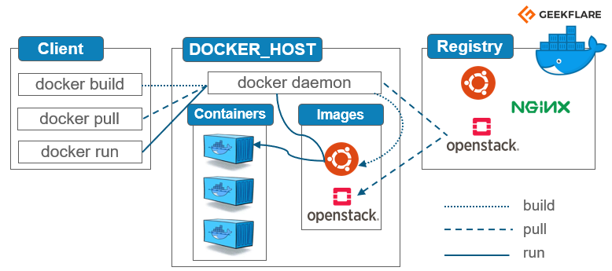

# 05 Docker

## Introduction

### Virtualisation vs Containerisation

La **virtualisation** et la **containerisation** sont deux approches différentes pour la gestion des ressources et l'isolation des applications sur un système hôte.

- **Virtualisation** : La virtualisation utilise des hyperviseurs pour créer des machines virtuelles (VMs), chaque VM exécutant un système d'exploitation complet. Cela nécessite plus de ressources car chaque VM contient son propre noyau d'OS.

- **Containerisation** : La containerisation utilise des conteneurs légers pour isoler les applications. Chaque conteneur partage le même noyau d'OS que l'hôte, ce qui les rend plus légers et plus rapides à démarrer.


## Installation de Docker

Pour installer Docker, suivez les instructions de la documentation officielle selon votre système d'exploitation :

- [Installation de Docker sur Linux](https://docs.docker.com/install/linux/)
- [Installation de Docker sur macOS](https://docs.docker.com/install/mac/)
- [Installation de Docker sur Windows](https://docs.docker.com/install/windows/)

!!! warning "Compatibilité Hyper-V"
    Docker Desktop for Windows utilise Hyper-V, qui peut être incompatible avec d'autres hyperviseurs tels que VirtualBox. Si vous avez déjà VirtualBox installé, assurez-vous de vérifier la compatibilité avant d'installer Docker Desktop. Pour plus d'informations, consultez la [documentation officielle de Docker](https://docs.docker.com/desktop/install/windows-install/).

## Dockerfile

Un **Dockerfile** est un script qui contient les instructions nécessaires pour créer une image Docker. Voici un exemple simple de Dockerfile pour une application web Node.js :

### Exemple de deploiement d'Application Node.js Simple via un container

Créez un dossier pour votre application Node.js et créez un fichier `app.js` avec le contenu suivant :

```javascript
// app.js
const http = require('http');

const server = http.createServer((req, res) => {
  res.statusCode = 200;
  res.setHeader('Content-Type', 'text/plain');
  res.end('Hello, Docker!\n');
});

const port = process.env.PORT || 3000;

server.listen(port, () => {
  console.log(`Server running on http://localhost:${port}`);
});
```

### Dockerfile

Créez un fichier appelé `Dockerfile` dans le même répertoire que votre application avec le contenu suivant :

```dockerfile
# Use the official Node.js image
FROM node:14

# Set the working directory
WORKDIR /usr/src/app

# Install app dependencies
RUN npm install

# Bundle app source
COPY . .

# Expose the port
EXPOSE 3000

# Command to run the application
CMD ["node", "app.js"]
```

## Docker Compose

**Docker Compose** est un outil pour définir et gérer des applications Docker multi-conteneurs. Vous pouvez utiliser un fichier `docker-compose.yml` pour spécifier les services, les réseaux et les volumes nécessaires à votre application.

### Commande utiles

La commande `docker-compose up -d` est utilisée pour démarrer les services définis dans votre fichier `docker-compose.yml` en mode détaché (arrière-plan). Cela signifie que les conteneurs Docker seront lancés en arrière-plan, et vous pourrez continuer à utiliser votre terminal pour d'autres tâches sans bloquer sur les journaux des conteneurs.

Voici comment utiliser cette commande :

```bash
docker-compose up -d
```

Assurez-vous d'exécuter cette commande dans le répertoire où se trouve votre fichier `docker-compose.yml`. Docker Compose utilisera ce fichier pour créer et configurer les conteneurs.

Après avoir exécuté cette commande, Docker Compose lancera tous les services définis dans le fichier `docker-compose.yml`. Vous pouvez vérifier l'état des services avec la commande suivante :

```bash
docker-compose ps
```

Cette commande affiche l'état de tous les services définis dans le fichier `docker-compose.yml`. Si les services sont en cours d'exécution, vous devriez les voir répertoriés avec l'état "Up".

Pour arrêter les services et supprimer les conteneurs, vous pouvez utiliser la commande suivante :

```bash
docker-compose down
```

Si vous souhaitez voir les journaux des services en cours d'exécution, vous pouvez utiliser la commande `docker-compose logs`. Par exemple, pour afficher les journaux du service "app" :

```bash
docker-compose logs app
```

N'oubliez pas de remplacer "app" par le nom réel de votre service.

### Deploiement avec Docker Compose

Créez un fichier `docker-compose.yml` dans le même répertoire avec le contenu suivant :

```yaml
version: '3'
services:
  app:
    build:
      context: .
    ports:
      - "3000:3000"
```

### Mappage de Port entre Hote et container

Le mappage de port dans Docker Compose permet de lier les ports d'un conteneur à des ports spécifiques de l'hôte, permettant ainsi aux services exécutés dans les conteneurs d'être accessibles depuis l'extérieur du conteneur.

Dans le fichier `docker-compose.yml`, la section `ports` sous un service spécifie le mappage de port. Voici comment cela fonctionne :

```yaml
version: '3'
services:
  app:
    image: my-node-app
    ports:
      - "3000:3000"
```

Dans cet exemple :

- `"3000:3000"` indique le mappage du port. Le premier numéro (3000 à gauche du `:`) représente le port sur l'hôte, tandis que le second numéro (3000 à droite du `:`) représente le port dans le conteneur.

Ainsi, avec cette configuration, le port 3000 du conteneur sera accessible à partir du port 3000 de l'hôte. Si vous avez plusieurs services, chaque service peut avoir son propre mappage de port.

Dans ce cas, Docker attribuera un port disponible sur l'hôte, et vous pouvez découvrir ce port avec la commande `docker-compose ps`.

Le mappage de port est essentiel pour exposer les services d'un conteneur à l'extérieur et permettre aux utilisateurs d'accéder à ces services depuis l'hôte ou d'autres machines dans le réseau, selon la configuration du réseau Docker.

### Mappage des volumes

Le mappage des volumes est une pratique essentielle dans Docker qui permet de persister les données générées par les conteneurs au-delà de leur cycle de vie. Lorsque vous exécutez un conteneur, ses données peuvent être stockées dans son système de fichiers interne. Cependant, une fois le conteneur arrêté ou supprimé, ces données peuvent être perdues. Le mappage de volumes résout ce problème en créant un lien entre un dossier sur l'hôte et un dossier à l'intérieur du conteneur.

Par exemple, pour créer un volume nommé "mydata" et le monter dans le répertoire "/app" d'un conteneur, vous pouvez utiliser l'option `-v` lors de la création du conteneur :

```bash
docker run -v mydata:/app my-image
```

Cela assure la persistance des données du conteneur dans le volume "mydata" sur l'hôte, permettant ainsi de partager des données entre plusieurs conteneurs ou de sauvegarder ces données même si le conteneur est supprimé.

Le mappage des volumes est particulièrement utile pour les applications nécessitant le stockage de données, comme les bases de données, les serveurs de fichiers, et autres. Il offre une flexibilité et une gestion facile des données dans le contexte des conteneurs Docker.

Voici un exemple simple d'utilisation du mappage de volumes avec Docker Compose. Supposons que vous avez une application Node.js qui stocke des données dans un dossier `/app/data` et que vous souhaitez persister ces données en utilisant un volume.

Créez un fichier `docker-compose.yml` avec le contenu suivant :

```yaml
version: '3'
services:
  webapp:
    image: my-node-app
    ports:
      - "3000:3000"
    volumes:
      - mydata:/app/data

volumes:
  mydata:
```

Dans cet exemple :

- Le service `webapp` utilise l'image `my-node-app` (remplacez cela par l'image réelle de votre application Node.js).
- Le mappage de port expose le port 3000 du conteneur vers le port 3000 de l'hôte.
- La section `volumes` crée un volume nommé "mydata" et le monte dans le répertoire `/app/data` du conteneur.

Lorsque vous lancez votre application avec `docker-compose up -d`, le volume "mydata" est créé, et les données générées par l'application dans le dossier `/app/data` du conteneur sont persistées sur l'hôte, dans le volume "mydata".

Cette approche garantit que les données de votre application restent disponibles même si le conteneur est arrêté ou supprimé. Vous pouvez également partager ce volume entre plusieurs services dans le même `docker-compose.yml` ou même entre plusieurs applications s'exécutant sur la même machine.

### Lancement des containners

Ouvrez un terminal dans le répertoire de votre application et exécutez la commande suivante pour construire et démarrer votre conteneur :

```bash
docker-compose up
```

Votre application Node.js sera accessible à l'adresse http://localhost:3000. Vous pouvez modifier le port dans le fichier `docker-compose.yml` si nécessaire.

N'oubliez pas d'arrêter les conteneurs avec la commande suivante lorsque vous avez terminé :

```bash
docker-compose down
```

Ceci est un exemple simple pour démarrer. Vous pouvez étendre et personnaliser votre Dockerfile en fonction des besoins de votre application.

## Commande de base quand on travaille avec docker

Voici quelques commandes de base indispensables à connaître pour travailler avec Docker :

1. **`docker --version`** : Affiche la version de Docker installée.

2. **`docker pull <image>`** : Télécharge une image Docker depuis Docker Hub ou un autre registre. Par exemple, `docker pull nginx` télécharge l'image NGINX.

3. **`docker images`** : Affiche la liste des images Docker téléchargées sur votre machine.

4. **`docker ps`** : Affiche la liste des conteneurs Docker en cours d'exécution.

5. **`docker ps -a`** : Affiche tous les conteneurs, qu'ils soient en cours d'exécution ou arrêtés.

6. **`docker run <options> <image>`** : Crée et démarre un conteneur à partir d'une image. Par exemple, `docker run -d -p 8080:80 nginx` démarre un conteneur NGINX en arrière-plan, exposant le port 8080 de l'hôte vers le port 80 du conteneur.

7. **`docker exec -it <container> <command>`** : Exécute une commande à l'intérieur d'un conteneur en cours d'exécution en mode interactif. Par exemple, `docker exec -it my-container /bin/bash` ouvre un shell Bash interactif à l'intérieur du conteneur.

8. **`docker stop <container>`** : Arrête un conteneur en cours d'exécution. Vous pouvez également utiliser `docker kill` pour arrêter immédiatement le conteneur.

9. **`docker rm <container>`** : Supprime un conteneur arrêté.

10. **`docker rmi <image>`** : Supprime une image Docker de votre système.

11. **`docker-compose up -d`** : Démarre les services définis dans le fichier `docker-compose.yml` en mode détaché.

12. **`docker-compose down`** : Arrête les services définis dans le fichier `docker-compose.yml` et supprime les conteneurs associés.

13. **`docker logs <container>`** : Affiche les journaux d'un conteneur spécifique.

14. **`docker network ls`** : Affiche la liste des réseaux Docker.

15. **`docker volume ls`** : Affiche la liste des volumes Docker.

Ces commandes constituent une base solide pour travailler avec Docker. N'oubliez pas de consulter la documentation officielle de Docker pour des informations plus détaillées sur chaque commande : [Documentation Docker](https://docs.docker.com/).



## Outil d'administration

**Portainer** est une interface graphique open source pour la gestion des conteneurs Docker. Il fournit une interface utilisateur web intuitive pour visualiser, gérer et déployer des applications dans des conteneurs Docker. Voici quelques caractéristiques clés de Portainer :

Pour utiliser Portainer, vous pouvez le déployer en tant que conteneur Docker unique à l'aide de la commande suivante :

```bash
docker run -d -p 9000:9000 --name=portainer --restart=always -v /var/run/docker.sock:/var/run/docker.sock portainer/portainer-ce
```

Cela lancera Portainer en mode détaché et le rendra accessible sur le port 9000 de votre machine. Vous pouvez ensuite accéder à l'interface web et commencer à gérer vos conteneurs.

En ce qui concerne d'autres outils similaires, voici quelques alternatives à Portainer :

1. **Kitematic :** Une interface graphique pour Docker compatible avec Windows, macOS et Linux.

2. **Rancher :** Une plateforme de gestion de conteneurs open source qui prend en charge Kubernetes et Docker.

3. **Swarm UI :** Une interface web native pour la gestion des clusters Docker Swarm.

4. **Cockpit :** Une interface web pour la gestion des serveurs Linux qui prend en charge Docker.

5. **Shipyard :** Une interface web open source pour la gestion de Docker.

Ces outils offrent des fonctionnalités similaires, mais la meilleure option dépend souvent des besoins spécifiques de votre environnement et de votre préférence en matière d'interface utilisateur.

## Clusterisation des noeuds Docker

**Docker Swarm** est un outil de gestion de cluster Docker intégré qui permet de créer et de gérer un ensemble de nœuds Docker, transformant ainsi plusieurs machines en un seul pool de ressources.
Outre Docker Swarm, d'autres solutions de gestion de clusters Docker incluent **Kubernetes**, **Apache Mesos**, et **Amazon ECS**. Chacune de ces solutions a ses propres caractéristiques et avantages, et le choix dépend souvent des besoins spécifiques de votre environnement. Par exemple, Kubernetes est largement utilisé pour les déploiements à grande échelle, tandis que Docker Swarm offre une configuration plus simple pour les cas d'utilisation plus modestes.


# Sécurité des Conteneurs Docker

La sécurité des conteneurs Docker est une préoccupation essentielle pour garantir la protection des applications et des données qu'ils contiennent. Voici un aperçu des bonnes pratiques de sécurité associées aux conteneurs Docker :

## 1. **Utiliser des Images Officielles et Vérifiées**

Privilégiez l'utilisation d'images officielles provenant de dépôts de confiance tels que Docker Hub. Assurez-vous que les images utilisées sont régulièrement mises à jour et bénéficient du support de la communauté.

## 2. **Mise à Jour Régulière des Images et des Conteneurs**

Les mises à jour fréquentes des images et des conteneurs sont cruciales pour corriger les vulnérabilités de sécurité. Automatisez ce processus autant que possible pour maintenir votre environnement à jour.

```bash
docker pull <image>:<tag>
docker-compose pull
```

## 3. **Utilisation de Non-root Users**

Évitez d'utiliser l'utilisateur root dans les conteneurs. Définissez un utilisateur non-root pour minimiser les risques potentiels.

```dockerfile
FROM base-image
USER nonrootuser
```

## 4. **Configuration Fine des Ressources**

Limitez les ressources disponibles aux conteneurs avec `--memory`, `--cpu`, et d'autres options pour prévenir les attaques par déni de service.

```bash
docker run --memory=512m --cpu=0.5 my-image
```

## 5. **Isolation des Réseaux**

Utilisez des réseaux Docker isolés pour empêcher les communications non autorisées entre conteneurs.

```bash
docker network create --driver bridge my-network
docker run --network=my-network my-container
```

En suivant ces meilleures pratiques de sécurité, vous pouvez renforcer la résilience de vos conteneurs Docker et atténuer les risques potentiels. Il est important de rester informé sur les mises à jour de sécurité et d'appliquer régulièrement les correctifs nécessaires pour garantir un environnement Docker sûr et fiable.

# Exemple de stack LAMP avec plusieurs containers (un peu obsolete aujourd'hui car repose sur une Debian 8)


```yaml
version: '3'
services:
    m_apache:
        build: docker/apache
        container_name: m_apache
        ports:
          - 80:80
        volumes:
          - ./docker/config/vhosts:/etc/apache2/sites-enabled
          - ./www:/var/www/html
        depends_on:
          - m_php

    m_mysql:
        image: mysql
        command: "--default-authentication-plugin=mysql_native_password"
        container_name: m_mysql
        volumes:
            - ./db:/var/lib/mysql
        environment:
            MYSQL_ROOT_PASSWORD: root
            MYSQL_DATABASE: mery
            MYSQL_USER: mery
            MYSQL_PASSWORD: mery

    m_php:
        build: docker/php
        container_name: m_php
        volumes:
          - ./www:/var/www/html
        depends_on:
          - m_mysql

    m_phpmyadmin:
        image: phpmyadmin/phpmyadmin
        container_name: m_phpmyadmin
        environment:
          PMA_HOST: m_mysql
          PMA_PORT: 3306
        ports:
            - 8080:80
        links:
            - m_mysql
```

### fichier docker/php/Dockerfile
```bash
FROM php:7.2.10-fpm

RUN apt-get update \
    && apt-get install -y --no-install-recommends vim curl debconf subversion git apt-transport-https apt-utils \
    build-essential locales acl mailutils wget nodejs zip unzip \
    gnupg gnupg1 gnupg2 \
    zlib1g-dev \
    sudo

RUN docker-php-ext-install pdo pdo_mysql zip

COPY php.ini /usr/local/etc/php/php.ini
COPY php-fpm-pool.conf 	/usr/local/etc/php/pool.d/www.conf

RUN curl -sSk https://getcomposer.org/installer | php -- --disable-tls && \
	mv composer.phar /usr/local/bin/composer

RUN wget --no-check-certificate https://phar.phpunit.de/phpunit-6.5.3.phar && \
    mv phpunit*.phar phpunit.phar && \
    chmod +x phpunit.phar && \
    mv phpunit.phar /usr/local/bin/phpunit

RUN	echo "deb https://deb.nodesource.com/node_6.x jessie main" >> /etc/apt/sources.list.d/nodejs.list && \
	wget -nv -O -  https://deb.nodesource.com/gpgkey/nodesource.gpg.key | apt-key add - && \
	echo "deb-src https://deb.nodesource.com/node_6.x jessie main" >> /etc/apt/sources.list.d/nodejs.list && \
    apt-get update && \
	apt-get install -y --force-yes nodejs && \
	rm -f /etc/apt/sources.list.d/nodejs.list

RUN groupadd dev -g 999
RUN useradd dev -g dev -d /home/dev -m
RUN passwd -d dev

RUN rm -rf /var/lib/apt/lists/*
RUN echo "en_US.UTF-8 UTF-8" > /etc/locale.gen && \
    echo "fr_FR.UTF-8 UTF-8" >> /etc/locale.gen && \
    locale-gen

RUN echo "dev ALL=(ALL) ALL" > /etc/sudoers

WORKDIR /var/www/
##</romaricp>##

EXPOSE 9000
CMD ["php-fpm"]
```
