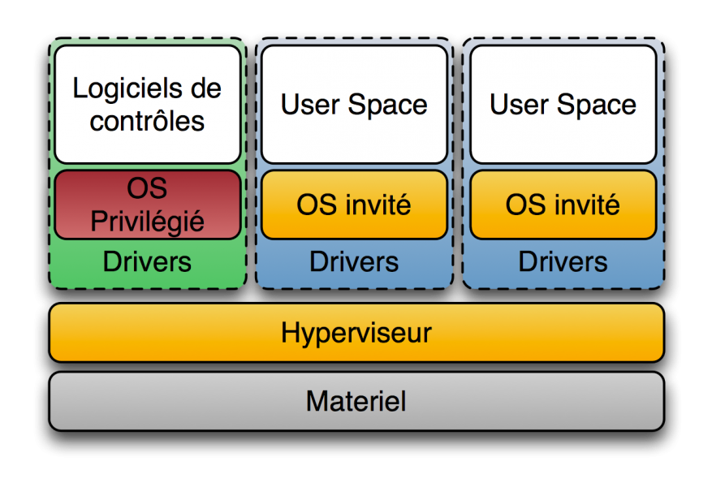
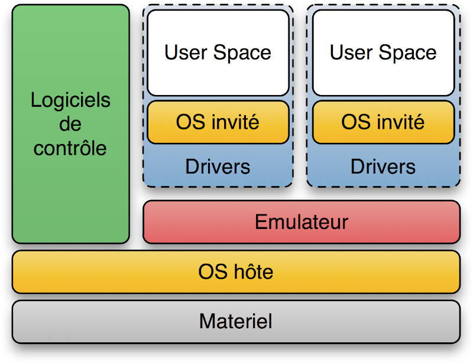

# Virtualisation

## Type d'hyperviseurs

Les hyperviseurs sont des logiciels qui permettent de créer et de gérer des machines virtuelles (VMs) sur un matériel physique. Il existe deux types principaux d'hyperviseurs : le type 1 (bare-metal) et le type 2 (hosted). Voici un aperçu des différences entre ces deux types d'hyperviseurs :

### Hyperviseur de Type 1 (Bare-Metal) :

1. **Exécution directe** : Les hyperviseurs de type 1 s'exécutent directement sur le matériel physique du serveur, sans nécessiter un système d'exploitation hôte intermédiaire. Cela signifie qu'ils ont un accès plus direct aux ressources matérielles.

2. **Performances** : En raison de leur accès direct au matériel, les hyperviseurs de type 1 ont tendance à offrir de meilleures performances que les hyperviseurs de type 2. Ils sont généralement utilisés dans des environnements où les performances sont essentielles, tels que les datacenters d'entreprise.

3. **Exemples** : VMware vSphere/ESXi, Microsoft Hyper-V (dans sa version pour serveurs), et KVM sont des exemples d'hyperviseurs de type 1.

4. **Utilisation** : Les hyperviseurs de type 1 sont généralement utilisés dans des environnements de production, où la virtualisation est une composante essentielle de l'infrastructure.

### Hyperviseur de Type 2 (Hosted) :

1. **Exécution au-dessus d'un système d'exploitation** : Les hyperviseurs de type 2 s'exécutent au-dessus d'un système d'exploitation hôte existant, ce qui signifie qu'il y a une couche logicielle supplémentaire entre l'hyperviseur et le matériel physique.

2. **Facilité d'utilisation** : Les hyperviseurs de type 2 sont généralement plus faciles à installer et à utiliser, car ils s'appuient sur un système d'exploitation existant. Ils sont souvent utilisés pour le développement, le test et l'apprentissage.

3. **Performances moindres** : En raison de la couche logicielle supplémentaire, les hyperviseurs de type 2 ont tendance à avoir des performances légèrement inférieures par rapport aux hyperviseurs de type 1. Cependant, pour de nombreuses charges de travail, cette différence de performance peut ne pas être significative.

4. **Exemples** : VirtualBox, VMware Workstation, Parallels Desktop (pour macOS) sont des exemples d'hyperviseurs de type 2.

5. **Utilisation** : Les hyperviseurs de type 2 sont souvent utilisés dans des environnements de développement, de test, d'émulation, et par des utilisateurs individuels qui souhaitent exécuter des systèmes d'exploitation invités sur leur propre machine.

En résumé, la principale différence entre les hyperviseurs de type 1 et de type 2 réside dans leur relation avec le matériel. Les hyperviseurs de type 1 s'exécutent directement sur le matériel, tandis que les hyperviseurs de type 2 s'exécutent au-dessus d'un système d'exploitation hôte. Le choix entre les deux dépend des besoins spécifiques de virtualisation et des performances de votre environnement.

## Solutions technique

Les hyperviseurs sont des logiciels qui permettent de créer et de gérer des machines virtuelles (VMs) sur un serveur physique. Ils sont essentiels pour la virtualisation, qui permet d'exécuter plusieurs systèmes d'exploitation et applications sur un seul matériel physique. Voici un petit cours sur les hyperviseurs, en mettant en avant VMware, Hyper-V, VirtualBox et Nutanix, tout en discutant des spécificités de l'hyperconvergence.

1. **VMware** :
   
 **Type d'hyperviseur** : VMware propose deux types d'hyperviseurs - VMware vSphere/ESXi pour les environnements d'entreprise et VMware Workstation/Fusion pour les environnements de développement et de test.
   
 **Caractéristiques** : VMware est l'un des leaders du marché de la virtualisation. Il offre des fonctionnalités avancées telles que la migration à chaud, la gestion automatisée des ressources, la haute disponibilité, la réplication et la gestion centralisée avec vCenter Server.

 **Hyperconvergence** : VMware propose une solution hyperconvergée appelée VMware vSAN. Il combine stockage et calcul sur un même cluster de serveurs pour simplifier la gestion et améliorer les performances.

2. **Hyper-V** :

 **Type d'hyperviseur** : Hyper-V est l'hyperviseur de Microsoft, intégré à Windows Server. Il existe également une version gratuite appelée Hyper-V Server.
   
 **Caractéristiques** : Hyper-V offre une virtualisation robuste avec des fonctionnalités telles que la migration en direct, la mise en cluster, la gestion à distance via Hyper-V Manager ou PowerShell, et la prise en charge des machines virtuelles Linux et Windows.

 **Hyperconvergence** : Microsoft propose Azure Stack HCI, une solution hyperconvergée basée sur Hyper-V. Elle offre une plateforme de calcul et de stockage hautement intégrée.

3. **VirtualBox** :

 **Type d'hyperviseur** : VirtualBox est un hyperviseur de type 2, ce qui signifie qu'il s'exécute sur un système d'exploitation hôte existant (Windows, macOS, Linux).
   
 **Caractéristiques** : VirtualBox est adapté pour les environnements de développement, de test et d'apprentissage. Il est open source et offre une interface utilisateur conviviale.

 **Hyperconvergence** : VirtualBox n'est pas généralement associé à des solutions hyperconvergées, car il est principalement utilisé pour la virtualisation locale.

4. **Nutanix** :

**Type d'hyperviseur** : Nutanix est une plateforme hyperconvergée qui intègre son propre hyperviseur, appelé Acropolis Hypervisor (AHV). Cependant, il prend également en charge d'autres hyperviseurs comme VMware ESXi et Hyper-V.
   
**Caractéristiques** : Nutanix offre une solution hyperconvergée tout-en-un, combinant stockage, calcul et gestion dans un cluster évolutif. Il simplifie la gestion, offre une haute disponibilité et une scalabilité linéaire.

**Hyperconvergence** : Nutanix est une solution hyperconvergée par excellence, car elle combine tous les éléments nécessaires pour exécuter des charges de travail virtualisées de manière efficace.

5. **Proxmox** :

**Type d'hyperviseur** : Proxmox VE est un hyperviseur de type 1 (bare-metal) basé sur KVM (Kernel-based Virtual Machine) pour la virtualisation matérielle et LXC (Linux Containers) pour la virtualisation basée sur conteneurs.

**Caractéristiques** :
- Gestion centralisée des machines virtuelles et des conteneurs via une interface web conviviale.
- Prise en charge de la haute disponibilité avec la possibilité de migration en direct des machines virtuelles.
- Intégration du stockage défini par logiciel (Software-Defined Storage) pour la gestion des données.
- Prise en charge des conteneurs Linux via LXC pour une efficacité accrue des ressources.
- Intégration de la sauvegarde et de la restauration des machines virtuelles et des conteneurs.

**Hyperconvergence**:
Proxmox VE est capable de créer une infrastructure hyperconvergée en utilisant son propre hyperviseur de type 1 et en combinant la virtualisation, le stockage et la gestion au sein du même système.
Il peut également être intégré à des solutions de stockage défini par logiciel tiers pour une approche encore plus intégrée de l'hyperconvergence.

L'**hyperconvergence**, en résumé, est une approche qui intègre le stockage, le calcul et la virtualisation dans une seule plateforme, simplifiant ainsi la gestion des centres de données et améliorant les performances. VMware vSAN, Azure Stack HCI et Nutanix sont des exemples de solutions hyperconvergées qui peuvent rationaliser l'infrastructure IT et réduire la complexité opérationnelle. Choisir la meilleure solution dépend des besoins spécifiques de votre organisation et de votre environnement.