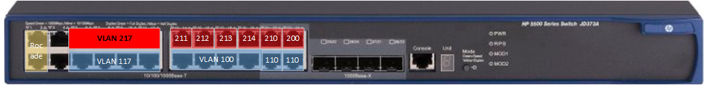
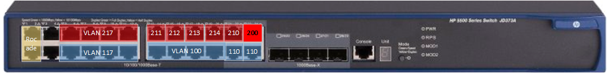

# Infrastructure

##  L’Infrastructure réseau du lycée Fulbert simulant le réseau SportLudique

L’infrastructure comporte plusieurs périmètres de sécurité. Les services
de *SportLudique* sont organisés en VLAN de niveau 1 (vlan par ports).

Les machines hôtes utilisables par les étudiants sont câblées via des
prises Ethernet murale de labo dont le numéro est pair (2-4-6-8).
Ces prises sont ensuite brassées sur les équipements dont vous avez la charge.

Les prises impaires respectivement (1,3,5,7) ne doivent pas être deconnectés du Switch HP (ou Huawei) sur leur port respectif
(1, 3, 5, 7) dans le vlan 117. On vous demande de ne pas modifier ces ports afin de revenir facilement dans une configuration classique
pour l’apprentissage et la connectivité au domaine **lan.sio.lyceefulbert.fr**

### Etape préalable pour travailler sur le contexte SportLudique

Le VLAN 200 est le VLAN Labo pour toute la promotion des deuxièmes
années SISR. Le VLAN 210 est le VLAN Labo de l’ îlot 1. Le 220 celui de
l’ îlot 2 etc…

Chaque site **Chartres**, **Tours**, **Orléans** et **Châteauroux** correspond à un îlot
et possède donc son propre VLAN isolé du reste du réseau du Labo du
lycée Fulbert.

L'ensemble des machnies clientes (OS utilisateurs) se ferra via des machines virtuelles locales gérées via **VirtualBox** connecté en mode **bridge**.
La machine physique devra donc être brassé correctement sur vos équipements, mais devra réster sur le domaine auquel elle a été attribué en début d'année.

Ainsi **à chaque début de séance** vous vous brasserez, **après avoir ouvert votre session windows**, correctement sur votre infrastructure via une prise murale **paire**.

Puis, **à chaque fin de séance** vous vérifierez que le poste est brassé sur une prise **impaire**.

## Gestion des serveurs

L'ensemble des serveurs nécessaires à vos infrastructure devra ^tre géré via la solution d'hyperconvergence **Nutanix** mis à disposition par vos enseignants.
Chaque machine virtuelle devra posséder un nom logique permettant de l'identifier sans ambiguité.
Ayant accès à l'ensemble des VM (y compris celle de l'infrastructure du BTS) merci de réspecter la convention de nom suivante **sous peine de suppression** pure est simple de celle ci:

### Préfixe à utiliser dans les noms des VM sur la ferme

|    **Ville**    |  **Prefixe** |
|-----------------|-----|
| Chartres         | CHA |
| Tours           | TRS |
| Orléans         | ORL |
| Châteauroux     | CHX |

### Configuration materielle géré par l'hyperviseur

Les capacités physiques des serveurs qui hébergent vos machines virtuelles ne sont pas infinies. Par conséquent, il est crucial de procéder à un dimensionnement optimal lors de la création de vos machines virtuelles. Par exemple, il est recommandé d'éviter d'allouer 16 Go de RAM à une machine virtuelle Windows. En ce qui concerne l'espace disque, une capacité de 500 Go est généralement suffisante pour la plupart des cas d'utilisation, à moins que les machines ne nécessitent de fortes activités d'écriture sur le disque, telles que les systèmes SIEM, les serveurs de journaux centralisés, les bastions, et ainsi de suite.

### Login et password non sécurisé à posséder

| Microsoft Windows      | administrateur / P@ssw0rd123456!      |
|------------------------|----------------------------------|
| Serveur                | nomuser / nomuser (géré dans l’annuaire AD) |
| Stations               |                                  |

| Distribution linux     | root /   P@ssw0rd123456!              |
|------------------------|----------------------------------|
| Switch / Routeurs      | admin / P@ssw0rd123456!              |
| Mode privilégié (enable)| P@ssw0rd123456!                       |

Il vous sera demandé de créer d'autres comptes plus personnalisés, qui seront par ailleurs gérés par un bastion d'accès. Ces comptes vous offriront un moyen d'accéder à votre infrastructure en cas de panne générale, ce qui les rend similaires à des portes dérobées indispensables pour vos activités d'apprentissage. 

!!! info "Attention"
    D'autres comptes devront être créés et seront gérés par un **bastion** d'accès. Ces comptes vous permettront d'avoir un accès en cas de dysfonctionnement général
    dans votre infrastructure. Ils peuvent être considérés comme une porte dérobée
    nécessaire pour votre apprentissage. Cependant, ils ne doivent pas être utilisés
    en production normale.

## L’Infrastructure réseau 

La structure générale du réseau comprend :

> \- Les sous réseaux des sites distants
>
> \- Les sous réseaux des départements
>
> \- Le réseau Backbone
>
> \- Le réseau WIFI
>
> \- La DMZ de chaque site géographique
>
> \- Le réseau d’accès à Internet

Le réseau *sportLudique* héberge tous les serveurs dans une baie de
serveurs installée dans le service Informatique du département Réseau.
Les serveurs hébergent les applications de gestion et de supervision du
parc informatique.

Le réseau mobile WIFI permet de servir les postes nomades du personnel
des différents sites. Ce réseau doit être assez souple et adaptable pour
fournir un accès à Internet au public externe sans toutefois
compromettre la sécurité du SI. 

### Plan d’adressage IP 

Le réseau général est construit autour de l’adresse **172.28.0.0** avec un
masque de **16 bits**. Ceci permet de couvrir l’ensemble du plan d’adressage
de l’entreprise mais aussi pour les évolutions. L’administrateur vous
demande de réfléchir aux découpages en sous réseau pour sécuriser les
différents services de chaque site. Le plan d’adressage IP **192.168.x.0
/24** est attribué à la DMZ de chaque site.

Les tableaux en annexe à compléter contiennent le plan d’adressage IP de
l’ensemble du réseau. 
Ce plan d’adressage tient compte d’une exploitation des adresses IP en mode dynamique par 2 serveurs DHCP.

La maintenance de ce plan d'adressage devra obligatoirement s'effectuer via la solution **phpipam** mis en place par votre enseignant (https://ipam.sio.lyceefulbert.fr).

Un bloc d’adresse est réservé pour les équipements en adressage fixe et
ceci pour chaque sous réseaux. Des règles d’ingénierie ont été définies
et imposent de placer les plages d’adresses fixes sur les adresses les
plus hautes de chaque sous réseau.

### Les éléments du réseau

Ce réseau regroupe les fonctions suivantes :

> \- Une structure de VLAN de niveau 3 est utilisée pour la
> structuration des réseaux WIFI. Cette structure permet de limiter les
> domaines de diffusion. Les VLANs de *sportludique* sont organisés
> selon une structure hiérarchique par département.
>
> \- Un VLAN de gestion permet d’accéder aux équipements de réseau via
> les postes Administrateur du service Informatique du département
> réseau. La gestion des équipements permet d’assurer la maintenance,
> les mises à jour des configurations ou des IOS et les opérations
> ponctuelles de surveillance et de test du réseau.
>
> \- Le routage des VLAN utilise la technique des sous interfaces VLAN
> et l’encapsulation 802.1Q implémentés dans les switch et routeurs.
>
> \- Un connexion Haut débit assure une liaison à l’Internet. Chaque
> site est connecté via à routeur au réseau publique via un prestataire
> (géré par votre professeur qui vous donnera en temps utile les
> adresses IP publiques utilisables).
>
> \- Chaque site dispose d’une connexion de secours de type xDSL fournie
> par un second FAI afin d’assurer une haute disponibilité de l’accès
> Internet. On réfléchira à une solution pour rendre les services web
> offerts par chaque site hautement disponible eux aussi.
>
> \- les serveurs DHCP et serveurs de nom DNS assurent la gestion des
> machines. Ces services doivent être installés sur 2 serveurs physiquement
> séparés pour assurer la tolérance aux pannes (HA).
>
> \- Un routeur filtrant assure les fonctions de pare feu entre le LAN,
> la DMZ et l’internet (WAN), l'appliance SN210 de **Stormshield** ou la distribution **pfsense** basée sur l'OS **BSD** (réputé pour son éfficacité en sécurité) devront être
> privilégiée pour cette tâche. Ce point névralgique devra être
> hautement disponible (impossible pour les SN210) lui aussi au moins sur le site physique de
> chartres.

### Infrastructure SportLudique (au siège à chartres)

L’entreprise comporte 6 services (6 VLANs minimum) dont le département
réseau qui renferme le service Informatique. Ce service assure la
gestion et administration du réseau et du parc informatique.

Les ressources informatiques (serveurs, bases de données, systèmes de
supervision…) sont situées dans une baie de serveurs.

Parmi ces serveurs on trouve les 2 serveurs DHCP en redondance à chaud
et le serveur Proxy qui se charge des requêtes http des personnels de
l’entreprise

Les salles ressources au rez de chaussée du bâtiment offrent des accès
aux équipements multimédia, vidéo, téléphones IP, imprimantes et
ordinateurs pour les utilisateurs externes tel que des clients ou des
fournisseurs.

Ces salles sont regroupées dans le nième VLAN intégré dans le
réseau.

### Abonnements Internet pour chaque site

Un abonnement FAI haut débit Fibre est géré par un routeur CISCO qui
supporte le trafic principal. Un abonnement FAI ADSL de secours devra
être mis en place chargé de prendre le relais en cas de panne de
l’abonnement du routeur primaire. Lorsque le lien primaire retrouve un
état opérationnel il reprend la gestion du trafic (Protocole
propriétaire Cisco HSRP).

Les 2 abonnements Internet sont souscris avec les opérateurs Orange et
SFR qui délivrent un contrat de service Pro Fibre 100Mb/s avec une SLA
GTR 4heures pour l’abonnement principal Fibre et un contrat bas débit
ASDL GTR 48Heures pour l’abonnement de secours.

|             |    **idVLAN**       | **Chartres**      | **Tours**        | **Orléans**      | **Chateauroux**  |
|------------|------------|-------------------|------------------|------------------|------------------|
| Abonnement **FIBRE** :| 200  | 183.44.28.2 /30  | 183.44.37.2 /30 | 183.44.45.2 /30 | 183.44.36.2 /30 |
| Abonnement **ADSL** : | 100    | 221.87.128.1 /30   | 221.87.137.1 /30  | 221.87.145.1 /30  | 221.87.136.1 /30  |

### Accès Internet et DMZ

Cette partie représente le périmètre de sécurité pour l’accès à
Internet. Une zone DMZ est intégrée dans le routeur pare-feu qui
règlemente les échanges l’accès à Internet. Ce routeur assure la gestion
du sous réseau DMZ qui renferme les services WEB et FTP, la fonction de
pare feu et l’interconnexion au réseau privé et Internet. Son
implémentation sera créée avec une VM connecté aux différents VLANS du
lycée Fulbert pour isoler les flux et simuler un véritable routeur
dédié.

Les 2 services SFTP et WEB de la DMZ sont intégrés dans une VM dans une
machine Windows ou linux pour héberger le site WEB de chaque site. Ces
services sont accessibles depuis l’Internet (simulé dans le labo) et le
réseau interne sous certaines conditions.

Le périmètre de sécurité est représenté par les fonctions suivantes :

> \- Pare Feu entre le réseau interne, la DMZ et Internet avec
> sécurisation par des règles de contrôle d’accès. Ces règles sont
> définies ci-dessous.
>
> \- Haute disponibilité sur l’accès à Internet assuré par 2 routeurs en
> HSRP avec fonction NAT/PAT. Une fonction port forwarding permet de
> rediriger les requêtes provenant de l’Internet (du routeur principal
> fibre) vers les ressources accessibles de l’association (http, FTP…).
>
> \- Pour compléter le périmètre de sécurité, un serveur Proxy WEB
> (Proxy squid) réglemente l’accès à Internet pour l’ensemble des
> utilisateurs internes de chaque site en les traçant excepté pour les
> postes d’administration du service Informatique.

**Règles de contrôle d’accès :**

> 1/ Seuls les requêtes du serveur Proxy peut accéder à Internet.
>
> 2/ Les Internautes peuvent accéder à la DMZ mais pas au réseau privé.
>
> 3/ Les sous réseaux de *SportLudique* peuvent accéder aux ressources
> de la DMZ.
>
> 4/ Les postes nomades du réseau Wifi ¨Visiteurs¨ n’ont accès qu’à
> Internet. Les postes du réseau Wifi ¨Employés¨ peuvent accéder au
> réseau Interne et à Internet.
>
> 5/ Le trafic ICMP est autorisé pour les postes du service
> Informatique.
>
> 6/ Le trafic ICMP provenant de l’Internet est interdit.

### Messagerie Electronique

Un serveur de messagerie sera aussi disponible sur chaque site. Le nom
de domaine sportludique.fr étant réservé, les adresses auront la forme
[utilisateur@&lt;ville&gt;.sportludique.fr](mailto:utilisateur@%3cville%3e.sportludique.fr)

Les utilisateurs devront pouvoir consulter leur messagerie du réseau
internet et du réseau publique. Des échanges seront évidemment possibles
entre chaque site géographique.

### Réseau WIFI

Pour cette maquette le réseau WIFI interne couvre la surface occupée
dans le bâtiment Hall d’accueil et l’espace extérieur qui couvrira les
zones utilisées pour les journées évènementielles porte ouverte. Ce
point d’accès contrôle 2 réseaux radios identifiés par un SSID.

Un SSID ¨Visiteurs¨ permet de fournit une connectivité Internet au
public externe à l’association dans le cadre de leur visite dans les
locaux ou lors d’activités événementielles type journées portes ouvertes
qui accueille du public ou des invités. Ce réseau offre une connectivité
ouverte non sécurisée à Internet. L’identification du réseau est
diffusée.

Un SSID ¨Employés¨ fournit au personnel interne munis de postes
portables l’accessibilité Internet et vers le réseau privé. Pour ce SSID
on utilise la sécurisation WPA et une authentification WPA2-Entreprise.
Pour ce réseau, le cryptage AES est utilisé et le SSID de réseau n’est
pas diffusée. L’authentification sera assurée via le contrôleur de
domaine ActiveDirectory et une stratégie d’accès au réseau sera
différente en fonction des groupes utilisateurs. Un test sera fait avec
une authentification par certificats électroniques.

Ces 2 réseaux sont séparés par des VLAN de niveau 3 et une règle sur le
routeur PRF permet d’éviter que les visiteurs puissent accéder au réseau
interne privé.

### Supervision de réseau, Maintenance et déploiement

En cas de panne l’analyse de problème réseau s’effectue via l’outil
d’analyse de trame Wireshark qui permettra de vérifier les anomalies de
fonctionnement du réseau pour la validation, les tests ou la mise en
service mais aussi le dépannage de situation en cas de blocage.

Une fonction de port mirroring sur les commutateurs Cisco permet
d’analyser les trafics sur les liens stratégiques

Un service d’administration à distance utilisant le protocole SSH
version 2 permet une prise de contrôle à distance des équipements
routeurs et commutateurs du réseau en mode sécurisé. L’application SSH
sera installée sur les équipements de réseau. Ce protocole utilise le
mode de chiffrement à clés asymétriques RSA (longueur de clé 1024).

Les équipements de réseau sont accessibles en SNMP pour permettre
l’exploitation du réseau par le logiciel de superivision (Centreon ou
autre solution compatible avec le protocole SNMP). On utilise la
communauté ¨spludique¨ pour les relations agent/serveur avec droits en
lecture. On utilisera les traps ou notifications snmp définies par Cisco
pour surveiller le fonctionnement du protocole HSRP sur les liaisons
internet, les ruptures de liens et les pannes et redémarrages des
équipements.

Le superviseur est dédié à la supervision des équipements de réseau
(commutateurs, routeurs, passerelles, Points d’accès).

L’outil de gestion de parc et gestion d’incidents GLPI permet d’assurer
le suivi et la gestion des postes et serveurs informatiques. Un service
de télé déploiement de logiciel devra être mis en place dans chaque site
par les équipes techniques.