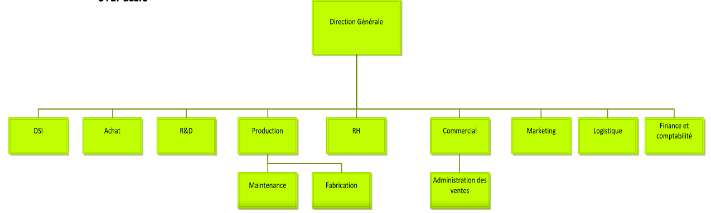
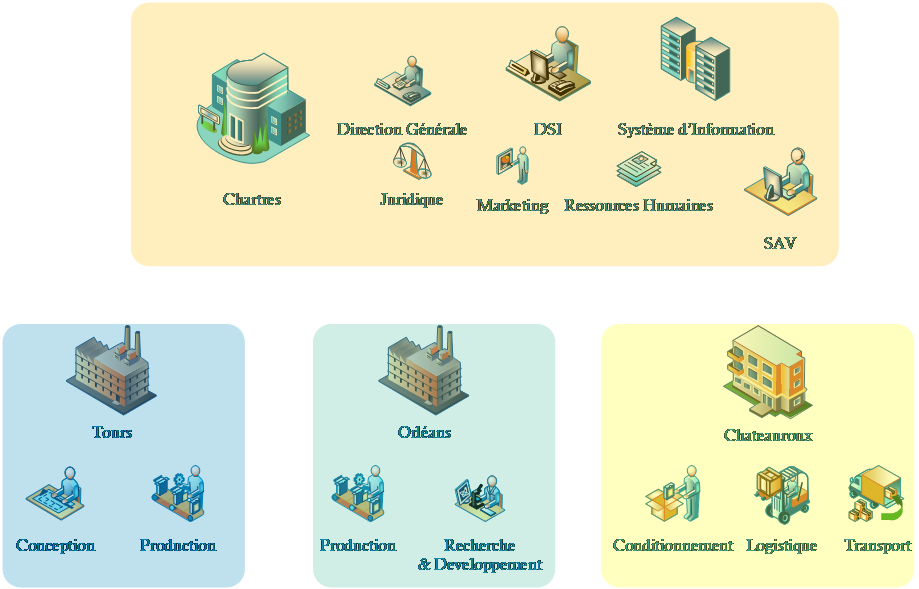
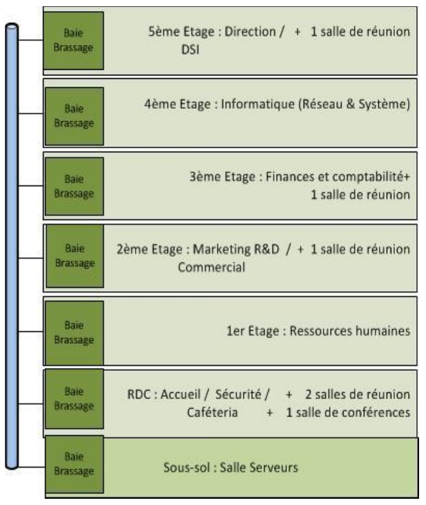
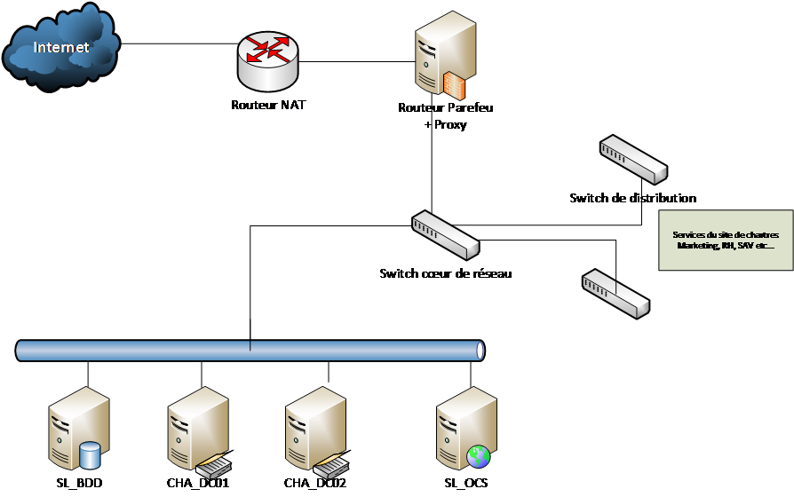
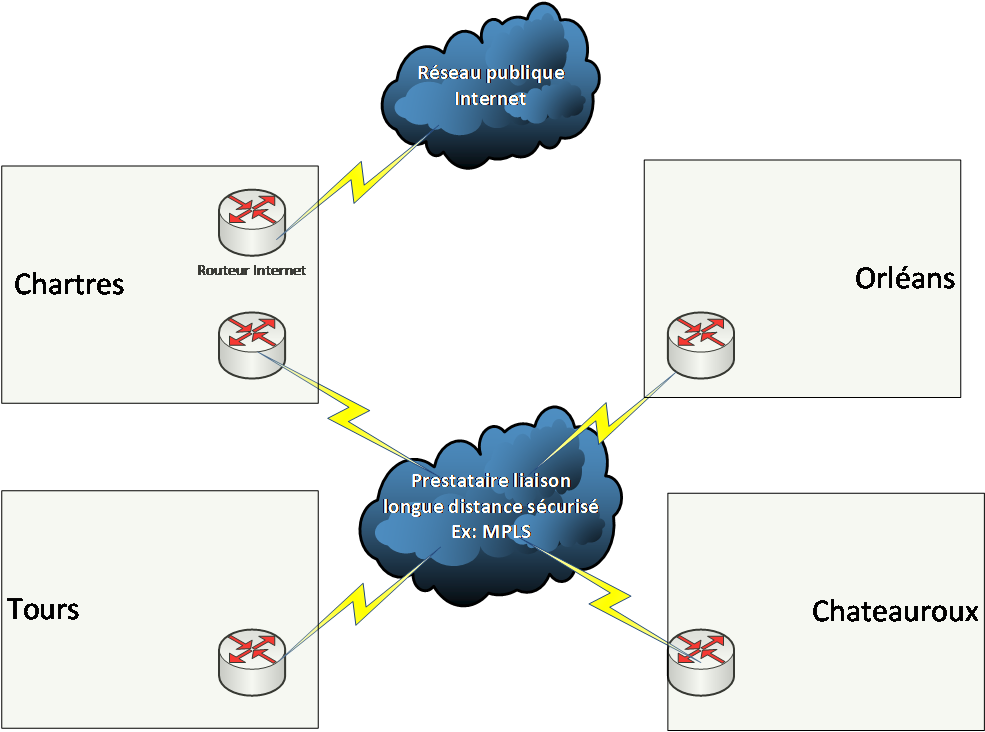

# Contexte SportLudique
## BTS SIO option SISR
## Année scolaire 2023-2024

### Auteur: MERY Ludovic

## Présentation générale de l’entreprise

##  Activité

SportLudique SARL est une société implanté en région centre spécialisée
dans la conception et la fabrication d’articles de sports et de loisirs
composée de 452 personnes réparties autour de trois sites géographiques
: Chartres, Tours, Orléans.

Elle dispose d’un quatrième site sur chateauroux suite à la mise en
place d’une filiale spécialisée dans la logistique.

Le siège de SportLudique se situe dans l’agglomération chartraine.

Elle enregistre de bons résultats grâce à une gamme de produits complète
(pour tous les âges) et connaît depuis peu un essor considérable
proposant des installations clé en main aux collectivités

## Données économiques et juridiques

<table>
<colgroup>
<col style="width: 50%" />
<col style="width: 49%" />
</colgroup>
<thead>
<tr class="header">
<th>Dénomination sociale</th>
<th>SportLudique</th>
</tr>
</thead>
<tbody>
<tr class="odd">
<td>Début d'activité : </td>
<td>16/10/1995</td>
</tr>
<tr class="even">
<td>Siret : </td>
<td>347839493 00021</td>
</tr>
<tr class="odd">
<td>Statut juridique</td>
<td>SARL</td>
</tr>
<tr class="even">
<td>Capital Social</td>
<td>485 000 €</td>
</tr>
<tr class="odd">
<td>Chiffre d’affaire 2014</td>
<td>8 562 000 €</td>
</tr>
<tr class="even">
<td>Benefice net 2014</td>
<td>1 735 200 €</td>
</tr>
<tr class="odd">
<td>Nombre d’employés</td>
<td>452</td>
</tr>
</tbody>
</table>

## Organigramme

{ align=left }

La Direction des Services Informatiques est sous la direction de
Monsieur Claude Postic

Celui-ci a sous ses ordres 4 techniciens.

Le service RH est dirigé par Ms Helen Paisley-Le Bihan.

##  Situation et répartition géographique

La société est articulée autour de quatre sites géographiques :

-   le site de Chartres : il regroupe la direction, le marketing, les
    > finances, les ressources humaines et la direction des services
    > informatiques (DSI) ;

-   le site d’Orléans : il regroupe l’usine de production des
    équipements extérieurs bois.

-   le site de Tours : il regroupe le laboratoire de test et la
    > production des équipements plastique

-   le site de Chateauroux : situé idéalement au centre de la France,
    > les stocks et la logistique sont la spécialité de ce site.

{ align=left }

##  Présentation de l’infrastructure Informatique

### Vu d’ensemble du Système d’Information

Le système d’information (SI) de SportLudique est à l’image de la
société : il a été bâti il y a quelques années et il connaît maintenant
une forte croissance. SportLudique est composée de quatre domaines NT
4.0 indépendants, un sur chaque site géographique, avec des relations
d’approbation bidirectionnelles entre les sites.

.

Au fil des différents projets informatiques, dus à l’essor de son
activité, des serveurs Windows 2000 Server et Windows Server 2003 ont
été ajoutés afin d’apporter de la robustesse et des fonctionnalités,
mais sans impact sur l’infrastructure. Le but principal était de relier
les sites, de communiquer, de répondre au besoin coûte que coûte.

Chaque site dispose de son propre service informatique (de
l’administration au support des utilisateurs).

Les utilisateurs sont administrateurs de leurs propres stations de
travail : ils utilisent des applications

bureautiques (style Office), graphiques ou maison, selon leurs
activités.

### Détail de l’infrastructure par site

#### Site de chartres (siège social)

| Nombre d’utilisateurs      | 132 |
|---------------------------|-----|
| Nombres de stations de travail | 132 |
| fixes                     | 100 |
| portables                 | 12  |
| Nombre de serveurs        | 10  |

#### Site d’Orléans

| Nombre d’utilisateurs      | 60  |
|---------------------------|-----|
| Nombres de stations de travail | 83  |
| fixes                     | 80  |
| portables                 | 3   |
| Nombre de serveurs        | 11  |

#### Site de Tours 

| Nombre d’utilisateurs      | 179 |
|---------------------------|-----|
| Nombres de stations de travail | 95  |
| fixes                     | 90  |
| portables                 | 5   |
| Nombre de serveurs        | 10  |

#### Site de chateauroux 

| Nombre d’utilisateurs      | 81  |
|---------------------------|-----|
| Nombres de stations de travail | 50  |
| fixes                     | 40  |
| portables                 | 10  |
| Nombre de serveurs        | 3   |

###  Détails des équipements serveurs par site

Site de Chartres

| **Nom**        | **Fonction**                               | **OS**                    |
|----------------|--------------------------------------------|--------------------------|
| **CHA_DC_01**  | Contrôleur principal de domaine            | Windows server 2008 R2   |
|                | Serveur primaire DNS                       | Domaine : chartres.local |
|                | Serveur DHCP                               |                          |
|                | Serveur de fichiers                        |                          |
| **CHA_DC_02**  | Contrôleur secondaire de domaine           | Windows server 2008 R2   |
|                | Serveur secondaire DNS                     |                          |
|                | Serveur de fichiers repliqué               |                          |
| **SL_BDD**     | Serveur de base de données                | Linux Debian 8 + MySQL   |
| **SL_OCS**     | Serveur d’inventaire                      | Linux Debian 8 + OCS Inventory |
| **…**          |                                            |                          |

Site d’Orléans

| **Nom**        | **Fonction**                               | **OS**                    |
|----------------|--------------------------------------------|--------------------------|
| **ORL_DC_01**  | Contrôleur principal de domaine            | Windows server 2008 R2   |
|                | Serveur primaire DNS                       | Domaine : orleans.local  |
|                | Serveur DHCP                               |                          |
|                | Serveur de fichiers                        |                          |
| **ORL_DC_02**  | Contrôleur secondaire de domaine           | Windows server 2008 R2   |
|                | Serveur secondaire DNS                     |                          |
|                | Serveur de fichiers repliqué               |                          |
| **…**          | …                                          | …                        |

Site de Tours

| **Nom**        | **Fonction**                               | **OS**                    |
|----------------|--------------------------------------------|--------------------------|
| **TRS_DC_01**  | Contrôleur principal de domaine            | Windows server 2008 R2   |
|                | Serveur primaire DNS                       | Domaine : tours.local    |
|                | Serveur DHCP                               |                          |
|                | Serveur de fichiers                        |                          |
| **TRS_DC_02**  | Contrôleur secondaire de domaine           | Windows server 2008 R2   |
|                | Serveur secondaire DNS                     |                          |
|                | Serveur de fichiers repliqué               |                          |
| **…**          | …                                          | …                        |

Site de Chateauroux

| **Nom**        | **Fonction**                               | **OS**                    |
|----------------|--------------------------------------------|--------------------------|
| **CHX_DC_01**  | Contrôleur principal de domaine            | Windows server 2008 R2   |
|                | Serveur primaire DNS                       | Domaine : chateauroux.local |
|                | Serveur DHCP                               |                          |
|                | Serveur de fichiers                        |                          |
| **CHX_DC_02**  | Contrôleur secondaire de domaine           | Windows server 2008 R2   |
|                | Serveur secondaire DNS                     |                          |
|                | Serveur de fichiers repliqué               |                          |
| **…**          | …                                          | …                        |

##  Topologie physique sur le site de chartres

{ align=left }

## Topologie Logique (dans un premier temps)

{ align=left }

##  Dysfonctionnement du SI

La DSI de l’entreprise a demandé en 2013 à une société extérieure
d’auditer son système d’information. Le rapport d’audit, daté de mars
2014, a permis de mettre en lumière les dysfonctionnements suivants:

### Des processus et des choix hétérogènes

Aujourd’hui, chaque site possède sa propre méthode de travail, ses choix
de systèmes d’exploitation et de logiciels. A titre d’exemple, chaque
site possède aujourd’hui son propre antivirus. Il reste donc très
difficile, voire souvent impossible, de mettre en place des solutions
globales au niveau de l’organisation.

### Des couts de gestion important

L’organisation regroupe, sur l’ensemble de ses quatre sites, une très
grande diversité de serveurs et de stations de travail :

La gamme des stations de travail est à l’égale de la gamme des serveurs
puisque l’on y retrouve des clients installés au fil des livraisons
matérielles.

Les techniciens du centre d’appels de la DSI (site de Chartres) sont
ainsi obligés de connaître plusieurs systèmes d’exploitation clients
tels que Windows 2000 Professionnel, Windows XP Professionnel, Windows
Vista Professionnel, Windows 7 sans oublier les différentes versions
serveurs de Windows ainsi que les différentes distributions Linux
utilisées (Debian, CentOS pour ne citer qu’elles) et les diverses
applications, souvent dupliquées quand elles ne sont pas triplées.

Cette situation induit une charge de travail et des coûts importants
pour le centre d’appels.

### Une réactivité lente

Vu la diversité des versions des systèmes d’exploitation des stations de
travail et des serveurs, la qualification des logiciels se voit
multipliée par trois.

Ainsi, par exemple, la suite bureautique Office est présente sous
différentes versions sur les différents

sites. Il faut donc tester le bon fonctionnement de chaque version
Office aussi bien sous Windows XP Professionnel que Windows 7
Professionnel ce qui ne se passe pas toujours bien.

En outre, lorsqu’un problème Office est détecté sur une plateforme ou
qu’un nouveau Service Pack sort afin d’améliorer la sécurité ou apporter
des fonctionnalités supplémentaires, il faut le temps de le tester et de
le déployer sans impact sur les autres plateformes.

L’entreprise souffre donc de problèmes de réactivité au niveau de la
gestion de son parc.

### Une gestion du parc informatique trop complexe

L’entreprise ne possède pas de méthode d’installation industrialisée
pour les systèmes d’exploitation

clients et serveurs.

La mise en service de stations de travail ou de serveurs se fait donc
manuellement. Cela nécessite la

mobilisation de techniciens spécialisés et formés à ces procédures
complexes. L’impact sur le délai de la mise en production et le coût des
machines est évidemment très conséquent.

### Un SI peu sécurisé

Le système d’informatique tel que défini actuellement est très peu
sécurisé.

Les principales défaillances repérées au niveau de la sécurité tiennent
aux faits suivants :

-   présence d’anciennes versions de systèmes d’exploitation, qui
    imposent par exemple de maintenir des protocoles de communication
    non sécurisés, octroi par défaut, à tous les utilisateurs, du statut
    d’administrateurs de leur station de travail, ce qui ouvre la voie,
    entre autre, à :

    -   l’installation d’applications non conformes,

    -   l’utilisation de périphériques externes (sans compter l’impact
        sur la gestion par le centre d’appels).

-   absence de système centralisé de mise à jour de correctifs.

## Objectifs stratégiques et Organisationnels de la DSI

Suite au rapport d’audit, la Direction a décidé de réagir pour corriger
les dysfonctionnements constatés et ainsi optimiser les performances
globales de l’entreprise.

Après concertation des différents acteurs du SI de l’entreprise, et de
multiples réunions de travail, le comité de direction a dressé pour
l’année 2015-2016, quatre grands axes de travail. Ces axes, qui
définissent en fait quatre objectifs stratégiques, concernent tous les
services de l’entreprise, mais s’adressent tout particulièrement à la
DSI.

Celle-ci les a convertis en objectifs opérationnels qui lui permettront
de faire évoluer le SI actuellement en place en adéquation avec les
demandes de la Direction.

### Objectif 1 : Réduire les coûts

L’entreprise bien qu’encore en pleine croissance perçoit un tassement du
marché sur lequel elle travaille : la concurrence se fait plus rude, les
clients sont de plus en plus regardant sur les prix.  
Pour maintenir sa position sur son marché, elle doit absolument
maintenir ses prix de vente. Cela passe par une maîtrise totale de ses
coûts de production, mais également de ses coûts structurels. L’audit
ayant montré que les coûts induits par les dysfonctionnements de son SI
étaient nombreux, la direction demande à la DSI de travailler dans le
sens d’une réduction des coûts d’infrastructure et de fonctionnement du
SI.

### Objectif 2 : Prendre en compte la dimension cartographique

La cartographie va sous peu évoluer du fait la la redistribution des
rôles entre les deux sites de production de Tours et Orléans :

Les 2 sites de production et d’acheminement de Tours et Rennes vont être
regroupés en un seul

(sur Tours), le site d’Orléans gardant sa spécificité de R&D.

La Direction demande particulièrement à la DSI de réfléchir dès
maintenant à la manière d’intégrer ces nouveaux paramètres dans
l’infrastructure existante.

### Objectif 3 Sécuriser le SI

La sécurité doit devenir primordiale, notamment en ce qui concerne son
système d’informations. Les réseaux étant constamment menacés par des
attaques provenant de sources différentes, la direction souhaite
renforcer la sécurisation de son système d'informations.

En ce sens, la Direction a demandé la mise en place d’un plan de
sécurité à tous les niveaux de l’entreprise, et notamment au niveau de
la DSI. Ce plan devra en permanence tenir compte du coût initial et
continu de la sécurité.

Pour répondre au mieux à cette demande, une phase de conception devra
être définie en introduction du plan de sécurité. Elle permettra
d’analyser tous les facteurs qui, s’ils ne sont pas identifiés, risquent

d’augmenter le coût de la sécurité, et de rechercher les technologies de
sécurité qui, si elles ne sont pas employées, feront échouer le projet.

Cette phase de conception s’articulera autour des points suivants :

-   la conception de la sécurité pour la gestion du réseau ;

-   la conception d’une infrastructure de mise à jour des dispositifs de
    sécurité ;

-   la conception d’un système de clients sécurisé.

Le plan de sécurité devra impérativement répondre aux exigences
suivantes :

-   Exigence Sécurité 1 : Considérer les exigences légales qui affectent
    la mise en œuvre de la sécurité

Pour intégrer les dispositions légales au sein de l’entreprise, il est
important de demander au service juridique de l’entreprise de vérifier
le plan de sécurité. Il s’agit entre autres de réaliser un certain
nombre de démarches auprès des organismes gouvernementaux et des
associations qui peuvent être des sources de conseils en matière de
sécurité.

-   Exigence Sécurité 2 : Mesurer l’impact des décisions de sécurité sur
    les utilisateurs finaux

Il faudra mesurer l’impact des décisions de sécurité sur l’utilisateur
final.

Par exemple, dans le cas du choix d’une stratégie de sécurisation des
comptes utilisateurs, une stratégie de mot de passe trop lourde (15
caractères) alliée à une stratégie de complexité de mot de passe
(lettres et chiffres), forcerait l’utilisateur à conserver son mot de
passe sur un papier, près de son ordinateur.

De même, une stratégie de verrouillage de comptes mal adaptée apportera
un surplus important de coups de téléphone au centre d’appels.

-   Exigence Sécurité 3 : Mesurer les risques en se fondant sur la
    probabilité et la criticité de la menace

Il est important de pouvoir mesurer les probabilités d’attaques, les
moyens mis en œuvre face à une menace ainsi que les réponses à ces
menaces, afin d’en estimer les coûts.

Prenons le cas de la probabilité d’une menace. Si on définit une échelle
des probabilités allant de 1 à 9 – 9 étant la probabilité la plus
importante qu’une menace se produise – et si on définit une échelle du
niveau de criticité allant de 1 à 9 – 9 étant la criticité la plus
élevée – une menace avec une probabilité de 2 et une criticité de 8 sur
cette échelle devra être prise en compte selon certaines considérations.

-   Exigence Sécurité 4 : Maintenir la disponibilité et
    l’interopérabilité des services

Appliquer une sécurité importante dans l’entreprise ne signifie pas que
l’activité doit s’arrêter. Que l’on ne puisse plus communiquer, échanger
des données ou encore piloter des applications n’est pas forcément le
signe d’un réseau sécurisé. Au contraire, il faut pouvoir garantir les
échanges de données en cryptant les informations, en s’assurant de la
compatibilité de certains protocoles avec les autres systèmes, en
veillant à l’aspect fonctionnel de l’infrastructure.

Les performances des machines doivent être prises en compte également :
en effet, l’utilisation excessive d’un protocole de cryptage peut
empêcher un ordinateur de communiquer dans un temps imparti.

-   Exigence Sécurité 5 : Répondre aux besoins d’évolutivité

Il ne faut pas que l’infrastructure notamment informatique devienne une
voie de garage dans

laquelle il ne sera plus possible d’évoluer.

-   Exigence Sécurité 6 : Sécuriser le service de R&D.

Ce service étant celui qui génère la valeur ajoutée de la société, il
faudra particulièrement le sécuriser, tant au niveau des matériels,
qu’au niveau de l’infrastructure (définition d’un domaine dédié) et de
la transmission des données.

### Objectif 4 : Placer l’entreprise dans une logique de développement durable.

La direction souhaite inscrire toutes ses actions dans une logique de
développement durable :

-   Réduction des consommations de papiers (dématérialisation de
    l'information)

-   Réduction des déplacements (recours aux visio-conférences)

-   Réduction des consommations d'énergie (électricité…)

-   Etc.

##  Objectifs opérationnels de la DSI

L’équipe informatique de la DSI a pris connaissance de l’ensemble des
demandes de la direction et en a dégagé, à son niveau, trois objectifs
opérationnels de travail :

Le premier objectif consistera à concevoir une nouvelle infrastructure
informatique qui proposera une plateforme matérielle et logicielle
commune à tous les sites. Elle sera la base d’un travail de fond sur la
réduction des coûts, la sécurisation et la réactivité du SI.

Exemples :

<table>
<colgroup>
<col style="width: 29%" />
<col style="width: 70%" />
</colgroup>
<thead>
<tr class="header">
<th>Réduction des couts</th>
<th>
allègement de la charge de travail du centre d’appels, par un

contrôle total de l’environnement de travail de l’utilisateur, et

donc recentrage des compétences et des champs

d’interventions des techniciens.
</th>
</tr>
</thead>
<tbody>
<tr class="odd">
<td>sécurisation</td>
<td>
contrôle total de l’environnement de travail : les utilisateurs
ne

pourront être vecteurs d’intrusion de virus par des

téléchargements malveillants, des clés USB...
</td>
</tr>
<tr class="even">
<td>Réactivité du SI</td>
<td>
réduction du temps de mise à jour des nouvelles versions des

logiciels applicatifs
</td>
</tr>
<tr class="odd">
<td>Développement durable</td>
<td>limitation des éditions papier, de la consommation d'énergie…</td>
</tr>
</tbody>
</table>

-   Le deuxième objectif visé est d’offrir une plus grande disponibilité
    de l’infrastructure, des serveurs et des stations de travail : cela
    participera également à la réduction des coûts. Tout doit être mis
    en œuvre pour simplifier l’accès aux données et accroître la
    productivité de l’utilisateur en lui assurant une haute
    disponibilité au SI.

-   Le troisième objectif portera sur l’industrialisation des
    installations des stations de travail et des serveurs, l’uniformité
    des choix logiciels et l’allégement de la charge de travail du
    centre d’appels.

### Objectif 1 : Réorganisation au sein d’une architecture unique

Informatiquement parlant, il est possible de considérer la filiale de
chateauroux de deux façons :

\- Soit comme un partenaire communiquant avec *SportLudique*,

\- Soit comme faisant partie intégrante de l’infrastructure de
*SportLudique*.

La direction souhaitant absorber juridiquement cette filliale, il paraît
évident de l’absorber dans la

l’infrastructure de *SportLudique* tout en conservant ses spécificités:

Il en découle que l’entreprise sera réorganisée de la façon suivante :

-   Les trois sites de Chartres, Orléans et Tours posséderont chacun un
    serveur d’infrastructure lié au domaine auquel il appartient,

-   La succursale de Chateauroux, qui ne concerne que dix utilisateurs,
    n’aura ni serveur d’infrastructure, ni domaine. Le SI sera
    accessible par un moyen sécurisé en utilisant une connexion
    distante.

#### Choix de la solution d’infrastructure organisationnelle

Les serveurs d’infrastructure auront les rôles de services réseaux, tels
que DNS, WINS, DHCP, Active

Directory et serveur de catalogue global.

La DSI a retenu la mise en œuvre d’un annuaire Active Directory basé sur
un modèle de forêt unique.

Cette solution permet d’exploiter les avantages de l’annuaire Active
Directory autour du nom de domaine ***sportludique.fr***. Le fait de
rassembler l’organisation de l’entreprise sous une forme de forêt unique
ne ferme pas les portes sur les possibilités d’isoler une partie de
l’entreprise ayant des besoins spécifiques, en matière de sécurité par
exemple.

L’annuaire Active Directory permet d’exploiter de nouvelles
fonctionnalités telles que la prise en compte des notions de site,
d’unité organisationnelle, de groupe universel.

On pourra appliquer des stratégies de groupe aux utilisateurs et aux
ordinateurs en fonction de critères multiples.

1.  Définition des domaines et contrôleurs de domaine

Afin de tenir compte des demandes de sécurité et de l’intégration du
site de chateauroux, l’organisation logique de l’entreprise devra être
redéfinie.

Par cette réorganisation, l’entreprise va réduire considérablement le
trafic réseau et les relations d’approbation au travers du réseau. Elle
conservera une certaine indépendance au niveau de l’administration, tout
en intégrant sa nouvelle filiale au sein d’une organisation unique.

#### Plan d’adressage IP

Cette réorganisation est l’occasion rêvée de remettre à plat le plan
d’adressage IP et le plan de nommage afin d’harmoniser et de simplifier
l’utilisation du réseau au travers des différents sites, de clarifier
les rôles des serveurs et d’anticiper le futur (rachat de nouvelles
sociétés par exemple).

###  Objectif 2 : Optimiser la gestion et la disponibilité de l’infrastructure

Tout doit être mis en œuvre plus rendre l’infrastructure globalement
plus disponible, tant au niveau des serveurs que de des postes
utilisateurs, ce qui revient à assurer une plus grande disponibilité et
donc productivité des utilisateurs et des techniciens du centre
d’appels.

Cela passera par différents moyens d’action :

#### Mise en place d’outils de gestion de par cet de supervision réseau

Pour pouvoir réduire le coût des serveurs et des stations de travail, il
sera important de limiter le nombre d’interventions et le temps passé
sur chaque machine.

Pour cela, deux actions de base devront être mises en place :

Les serveurs seront installés à partir de techniques dites silencieuses,
avec des fichiers de réponses.

Les stations de travail seront industrialisées avec l’installation des
Service Packs et autres. Les postes utilisateurs seront préconfigurés
avec les logiciels nécessaires au fonctionnement de la station de
travail de base.

Les outils de gestion de parc et de supervision de réseau devront donc
être étudiés et mis en place, afin de rationaliser les interventions du
centre d’appels.

#### Mise en place d’outils de déploiement

On déploiera les logiciels par l’intermédiaire de la technologie
Intelligente proposé par les systèmes d’exploitation (Stratégies de
groupes par exemple) ou des solutions applicative spécialisées
(déploiement via OCS par exemple).

Pour réduire les coûts liés aux interventions des techniciens sur les
sites, on mettra en place un modèle de poste standard.

#### Homogénéité logiciels des stations de travail

Pour garantir la bonne utilisation des postes, la DSI publiera les
logiciels de base, ce qui présentera l’intérêt de permettre une remise
en état automatique en cas de suppression volontaire ou involontaire de
la part de l’utilisateur.

#### Limitation des droits des utilisateurs

Pour ne plus avoir de problèmes de stabilité sur les stations de
travail, les utilisateurs ne seront plus administrateurs de leur
station. Il faudra donc utiliser la politique du moindre privilège.

On utilisera des modèles de sécurité pour appliquer des paramètres de
sécurité cohérents sur l’ensemble des stations de travail de
l’organisation. On créera des stratégies de groupe en fonction des
besoins des services (ressources humaines, finances…) et des contraintes
de domaine et de site, pour assurer la meilleure utilisation des postes
selon les besoins spécifiques, et uniquement les besoins.

La mise en place de clichés instantanés permettra aux utilisateurs de
gérer eux-mêmes les sauvegardes des différentes versions de leurs
fichiers. Par une interface très simple, ils pourront restaurer des
versions antérieures et ainsi diminuer le nombre de coups de téléphone
au centre d’appels.

L’étude des stratégies de compte en fonction des besoins de chaque
domaine contribuera également à l’effort de réduction de la charge
d’appels.

#### Application de quotas d’espace de stockage aux utilisateurs

Pour limiter l’utilisation des serveurs de fichiers et maîtriser les
dépenses dues à l’achat d’espace disque, on appliquera des quotas.

L’action d’un utilisateur sur un poste se limitera uniquement aux
besoins de son périmètre. Il sera

important de limiter, voire d’empêcher l’installation de logiciels
exotiques (non nécessaires à l’entreprise), qui sont facteurs de
réinstallation des postes et de surplus de coups de téléphone au centre
d’appels (helpdesk).

#### Mettre en place des services réseaux

Messagerie, téléphonie sur IP, services d’impression, accès nomades

#### 

#### Mettre en place d’outils de gestion

PGI, SGBD, outils collaboratifs...

### Objectif 3 : Sécuriser l’Infrastructure

Pour répondre aux objectifs de sécurité imposés par la Direction, la
sécurité devra être implémentée à plusieurs niveaux fonctionnels :
infrastructure, systèmes, processus, flux.

Il sera nécessaire d’étudier les solutions les moins onéreuses et de
regarder les technologies de sécurité apportées par Windows Server 2008
R2, Windows 7 pouvant répondre au mieux au plan de sécurité.

Windows 10 venant tout juste d’être mis à disposition la DSI souhaite
attendre un retour d’expérience utilisateur sur ce nouvel OS qualifié de
prometteur puisque intégrant le meilleurs de Windows 7 et Windows 8.

Les solutions basées sur les **systèmes libres** seront aussi
envisagées.

#### Sécurisation du matériel de l’infrastructure

Les serveurs qui joueront un rôle important dans l’infrastructure
devront être sécurisés dans une salle

prévue à cet effet. L’ensemble des serveurs pourra être accessible via
une solution basée sur un cluster d’hyperviseur pour faciliter leur
gestion et réduire l’encombrement. La solution d’infrastructure ainsi
virtualisée, **devra être constamment documenté par les techniciens**.
Les utilisateurs devront être tenus responsables de l’usage du matériel
informatique mis à leur disposition par l’entreprise (PC, portables,
téléphones...). Les contrats de travail et la charte informatique de
l’entreprise devront être revus en ce sens.

#### Sécurisation des flux

Certaines communications de l’entreprise doivent être protégées.

Il s’agit entre autre, d’isoler l’activité de recherche et de
développement du site d’Orléans et de crypter les données sensibles. Les
techniques de VLAN, de DMZ, de VPN et de cryptage des données seront
privilégiées.

## Schéma de liaisons distantes souhaitées dans un second temps.

{ align=left }
