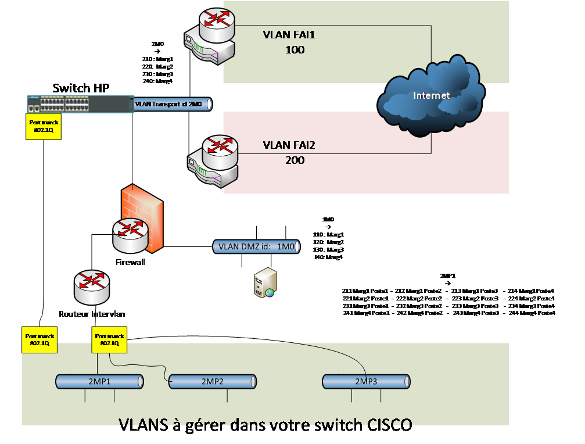
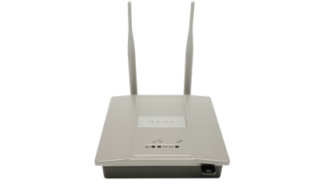

# Infrastrucure

## Dossier technique de l’infrastructure du réseau *SportLudique*

## Lycée Fulbert Chartres 2023-2024

**Auteur :** Ludovic MERY

## Introduction :

Les Projets Personnels Encadrés (PPE) seront développés autour du
contexte *SportLudique*. Cet environnement permettra à l’étudiant de
réaliser un ensemble de projets autour de différentes situations
professionnelles (les missions) et acquérir ainsi les compétences en
conformité avec le référentiel.

## Rappel du contexte :

*SportLudique* est une société basée sur 4 sites distants **Chartres**,
**Tours**, **Orléans** et **Châteauroux**. Elle est spécialisée dans la conception
et la production d’articles de sports non conventionnels.

L’infrastructure informatique et réseau est prise en charge par le
département **"Solutions d’Infrastructure Système et Réseau" (SISR)** qui se
charge de l’exploitation de l’ensemble des équipements du parc ainsi que
de la réalisation des projets informatiques.

La DSI délègue les taches techniques de réalisation, déploiement,
maintenance et support à son prestataire maître d’œuvre autour d’un
contrat de service dans lequel il assure la maîtrise d’ouvrage.

## Présentation Générale de l’infrastructure :

L’infrastructure est découpée en 3 parties comprenant
le siège ainsi que les différents sites distants et le réseau d’accès à
Internet. La DSI est responsable de l’administration de
l’infrastructure, de la fourniture de services et de la sécurisation des
données en déléguant ces tâches à son prestataire homologué qui est le
maître d’œuvre pour la réalisation des opérations d’administration du
système d’information de *SportLudique*.

Le service Informatique de *SportLudique* est mandaté pour l’exécution
de tous les projets qui concernent le parc informatique de l’entreprise
et agit comme prestataire au travers de contrats de service vis-à-vis
des différents sites distants. Chaque site dispose d’une infrastructure
avec un domaine **&lt;nomville&gt;.sportludique.fr** .
Un Controlleur de domaine disposant d'un service d’annuaire Active Directory assure la gestion et
l’administration du réseau.

Le nom de domaine *sportludique.fr* a été réservé auprès de l’AFNIC et
le bureau d’enregistrement (registar) gérant ce nom de domaine est
nordnet (en réalité il est géré par l’enseignant M MERY et n'est donc pas accessible sur le web de chez vous, il le sera via l'utilisation d'un VPN mis à disposition par votre enseignant).

## WHOIS

Le nom de domaine "**sportludique.fr**" est déjà déposé.

 Résultat de votre recherche

-   **Nom de domaine :** sportludique.fr

-   **État :** Actif

-   **DNSSEC :** inactif

-   **Bureau d'enregistrement
    > :** [**NORDNET**](http://www.afnic.fr/fr/produits-et-services/services/whois/)

-   **Date de création : **29 mai 2020 17:37

-   **Date d'expiration : **29 mai 2030 17:37

-   **Serveurs de noms (DNS)**

    -   ***Serveur n° 1: **ns2.lerelaisinternet.com*

    -   ***Serveur n° 2: **ns1.lerelaisinternet.com*

##  L’Infrastructure réseau du lycée Fulbert simulant le réseau SportLudique

L’infrastructure comporte plusieurs périmètres de sécurité. Les services
de *SportLudique* sont organisés en VLAN de niveau 1 (vlan par ports).

Les machines hôtes utilisables par les étudiants sont câblées via des
prises Ethernet murale de labo dont le numéro est pair (2-4-6-8).
Ces prises sont ensuite brassées sur les équipements dont vous avez la charge.

Les prises impaires respectivement (1,3,5,7) ne doivent pas être deconnectés du Switch HP (ou Huawei) sur leur port respectif
(1, 3, 5, 7) dans le vlan 117. On vous demande de ne pas modifier ces ports afin de revenir facilement dans une configuration classique
pour l’apprentissage et la connectivité au domaine **lan.sio.lyceefulbert.fr**

{ align=left }

### Etape préalable pour travailler sur le contexte SportLudique

Le VLAN 200 est le VLAN Labo pour toute la promotion des deuxièmes
années SISR. Le VLAN 210 est le VLAN Labo de l’ îlot 1. Le 220 celui de
l’ îlot 2 etc…

{ align=left }

Chaque site **Chartres**, **Tours**, **Orléans** et **Châteauroux** correspond à un îlot
et possède donc son propre VLAN isolé du reste du réseau du Labo du
lycée Fulbert.

L'ensemble des machnies clientes (OS utilisateurs) se ferra via des machines virtuelles locales gérées via **VirtualBox** connecté en mode **bridge**.
La machine physique devra donc être brassé correctement sur vos équipements, mais devra réster sur le domaine auquel elle a été attribué en début d'année.

Ainsi **à chaque début de séance** vous vous brasserez, **après avoir ouvert votre session windows**, correctement sur votre infrastructure via une prise murale **paire**.

Puis, **à chaque fin de séance** vous vérifierez que le poste est brassé sur une prise **impaire**.

## Gestion des serveurs

L'ensemble des serveurs nécessaires à vos infrastructure devra ^tre géré via la solution d'hyperconvergence **Nutanix** mis à disposition par vos enseignants.
Chaque machine virtuelle devra posséder un nom logique permettant de l'identifier sans ambiguité.
Ayant accès à l'ensemble des VM (y compris celle de l'infrastructure du BTS) merci de réspecter la convention de nom suivante **sous peine de suppression** pure est simple de celle ci:

### Préfixe à utiliser dans les noms des VM sur la ferme

|    **Ville**    |  **Prefixe** |
|-----------------|-----|
| Chartres         | CHA |
| Tours           | TRS |
| Orléans         | ORL |
| Châteauroux     | CHX |

### Configuration materielle géré par l'hyperviseur

Les capacités physiques des serveurs qui hébergent vos machines virtuelles ne sont pas infinies. Par conséquent, il est crucial de procéder à un dimensionnement optimal lors de la création de vos machines virtuelles. Par exemple, il est recommandé d'éviter d'allouer 16 Go de RAM à une machine virtuelle Windows. En ce qui concerne l'espace disque, une capacité de 500 Go est généralement suffisante pour la plupart des cas d'utilisation, à moins que les machines ne nécessitent de fortes activités d'écriture sur le disque, telles que les systèmes SIEM, les serveurs de journaux centralisés, les bastions, et ainsi de suite.

### Login et password non sécurisé à posséder

| Microsoft Windows      | administrateur / Azerty1234      |
|------------------------|----------------------------------|
| Serveur                | nomuser / nomuser (géré dans l’annuaire AD) |
| Stations               |                                  |

| Distribution linux     | root / Azerty1234                |
|------------------------|----------------------------------|
| Switch / Routeurs      | admin / Azerty1234              |
| Mode privilégié (enable)| Azerty1234                       |

Il vous sera demandé de créer d'autres comptes plus personnalisés, qui seront par ailleurs gérés par un bastion d'accès. Ces comptes vous offriront un moyen d'accéder à votre infrastructure en cas de panne générale, ce qui les rend similaires à des portes dérobées indispensables pour vos activités d'apprentissage. 

!!! info "Attention"
    D'autres comptes devront être créés et seront gérés par un **bastion** d'accès. Ces comptes vous permettront d'avoir un accès en cas de dysfonctionnement général
    dans votre infrastructure. Ils peuvent être considérés comme une porte dérobée
    nécessaire pour votre apprentissage. Cependant, ils ne doivent pas être utilisés
    en production normale.

###  Liste des serveurs obligatoires pour l'examen:

Les machines virtuelles à créer et à héberger sur la ferme de serveur sur chaque site (donc dans chaque VLAN d’îlot)
:

#### Contrôleurs de domaine 

-   Contrôleur de domaine AD-DC
-   Service DNS
-   Service DHCP

Dans le cadre de la gestion de l'infrastructure informatique, la mise en place de contrôleurs de domaine est cruciale pour assurer l'administration centralisée et sécurisée des ressources du réseau. Il existe deux types principaux de contrôleurs de domaine : le contrôleur de domaine principal et le contrôleur de domaine secondaire.

##### Contrôleur de domaine principal

Le contrôleur de domaine principal, également appelé PDC (Primary Domain Controller), occupe une place centrale dans l'architecture du domaine. Il est responsable de la gestion des opérations de base liées à l'authentification des utilisateurs, à l'autorisation d'accès aux ressources et à la gestion des politiques de sécurité. En cas de modification des informations du domaine, le contrôleur de domaine principal est le point de référence.

##### Contrôleur de domaine secondaire

Les contrôleurs de domaine secondaires, ou BDC (Backup Domain Controllers), jouent un rôle de sauvegarde et de répartition de la charge par rapport au contrôleur de domaine principal. Ils reproduisent les informations du contrôleur de domaine principal pour garantir une redondance et une disponibilité élevées. En cas de panne du contrôleur de domaine principal, les contrôleurs de domaine secondaires peuvent prendre en charge les opérations critiques, évitant ainsi une interruption majeure des services.

Il est important de noter que la mise en place d'un contrôleur de domaine principal et de contrôleurs de domaine secondaires permet une gestion fiable et sécurisée de l'annuaire, des comptes d'utilisateurs et des stratégies de groupe. Cette architecture renforce la disponibilité des services et facilite la gestion du réseau, tout en minimisant les risques de perte de données et de temps d'arrêt.

La combinaison d'un contrôleur de domaine principal et de contrôleurs de domaine secondaires constitue un élément clé de la gestion de l'infrastructure d'un réseau, qu'il soit de petite ou de grande taille.

#### Un serveur de déploiement d’image de stations de travail

\- Au choix parmi les solutions suivantes à documenter (gestion du **multicast**):

-   ServeurMicrosoft **WDS**
-   Serveur **FOG**
-   Serveur **CloneZilla**

??? info "Attention"
    Le multicast en informatique est une méthode de communication réseau où un expéditeur envoie des données à un groupe spécifique de destinataires plutôt qu'à tous les nœuds du réseau (broadcast). Cela permet d'économiser la bande passante en envoyant une seule copie des données aux membres du groupe intéressés, au lieu de multiplier les envois comme dans les envois en unicast. Le multicast est couramment utilisé pour la diffusion de contenu en streaming, les mises à jour de logiciels et d'autres applications nécessitant la transmission d'informations à un groupe ciblé. C'est la solution utilisé pour déployer vos poste de travail en début d'année (via le boot PXE au demarrage de la machine physique).

#### Un logiciel de bonne pratiques ITIL

##### Utilisation de logiciels conformes aux bonnes pratiques ITIL

Dans le cadre de l'alignement sur les meilleures pratiques de gestion des services informatiques ITIL (Information Technology Infrastructure Library), l'utilisation de certains logiciels spécifiques peut grandement faciliter la gestion et l'organisation des processus IT.

###### Gestion de parc informatique et incidents

Pour la gestion efficace du parc informatique et le suivi des incidents, l'outil **GLPI** associé à **Fusion Inventory** s'avère très utile. Ces solutions permettent de créer un inventaire précis des équipements, de gérer les tickets d'incidents et de fournir une vue globale des ressources informatiques.

###### Gestion des configurations et des outils associés

La gestion des configurations est un élément fondamental pour maintenir une infrastructure informatique cohérente et conforme aux bonnes pratiques ITIL. Les outils suivants jouent un rôle clé dans ce processus :

###### Outils de gestion des configurations

Deux outils largement adoptés et conformes aux bonnes pratiques ITIL sont **Ansible** et **Puppet**. Ils automatisent le déploiement, la configuration et la gestion des systèmes et des applications. Ces outils vous permettent de garantir la cohérence et la conformité des configurations tout en simplifiant l'administration.

Dans les environnements Windows, l'utilisation de **GPO** (Group Policy Objects) est courante pour définir et gérer les politiques de sécurité et de configuration. Par ailleurs, **GLPI** peut être utilisé comme service de déploiement de logiciels. Pour les environnements Microsoft, l'outil **chocolatey** simplifie le processus de gestion et de déploiement des logiciels.

#### Un service de Proxy filtrant (implémentation au choix après études des possibilités)

-   Proxy filtrant : (Exemple **SquidGuard**)
-   Authentification transparente et traçabilité des accès dans un serveur de logs
-   Possibilité d'utiliser le service correspondant d'un parefeux UTM

!!! info "Attention"
    Un **pare-feu UTM (Unified Threat Management)** est une solution de sécurité réseau intégrée qui combine plusieurs fonctionnalités de sécurité au sein d'un seul appareil. Contrairement aux pare-feux traditionnels qui se concentrent principalement sur le filtrage de paquets à la couche 3 et 4, les pare-feux UTM offrent une protection plus complète en intégrant diverses capacités de sécurité au sein d'une seule plateforme. Voici les principales caractéristiques et fonctionnalités d'un pare-feu UTM :

-   **Filtrage des paquets traditionnel** : Comme les pare-feux classiques, les UTM assurent le filtrage des paquets en fonction des adresses IP sources et de destination, ainsi que des ports utilisés.

-    **Protection antivirus et antimalware** : Les pare-feux UTM intègrent des moteurs antivirus et antimalware pour détecter et bloquer les logiciels malveillants et les virus dans le trafic réseau.

-    **Filtrage d'URL et de contenu** : Ils peuvent filtrer le trafic Web en fonction de catégories d'URL pour empêcher l'accès à des sites malveillants, inappropriés ou non conformes. (Pornographie, jeux en ligne, racisme etc...)

-    **Prévention des intrusions (IPS)** : Les UTM surveillent le trafic réseau pour détecter les tentatives d'intrusion et les activités suspectes, puis prennent des mesures pour les bloquer.

-    **Filtrage d'email et de spam** : Ils incluent des fonctionnalités de filtrage d'email pour bloquer les courriers indésirables, les spams et les attaques par email.

-    **VPN (Virtual Private Network)** : Ils offrent des capacités VPN pour établir des connexions sécurisées entre différents sites ou utilisateurs distants.

-    **Journalisation et rapports** : Les UTM offrent des fonctionnalités de journalisation détaillée et de création de rapports pour aider à surveiller l'activité du réseau et à identifier les menaces potentielles.

-    **Gestion centralisée** : Souvent, les pare-feux UTM peuvent être gérés de manière centralisée, ce qui facilite la configuration, la surveillance et la gestion de plusieurs appareils.

#### Un serveur de centralisation des évennements ou un SIEM

!!! info "Définition"
    **Serveur de log (syslog)** :
    Un serveur de logs est un système qui collecte, stocke et gère les logs (journaux) générés par divers dispositifs, applications et systèmes au sein d'un réseau informatique. Les logs peuvent inclure des informations sur les activités, les erreurs, les événements et les incidents qui se produisent dans l'environnement informatique. Le principal objectif d'un serveur de logs est de centraliser ces données pour une surveillance ultérieure, la recherche de problèmes et la conformité réglementaire. 
    Cependant, les serveurs de logs ne sont pas toujours équipés d'outils avancés d'analyse ou de corrélation des données.

!!! info "Définition"
    **SIEM (Security Information and Event Management)** :
    Un SIEM est une solution plus avancée qui va au-delà de la simple collecte de logs. Il intègre la collecte, la corrélation, l'analyse et la visualisation des données de sécurité à partir de diverses sources, telles que les serveurs, les réseaux, les applications et les systèmes. Les SIEM identifient les schémas et les anomalies dans les événements pour détecter les menaces potentielles ou les incidents de sécurité.

#### Un serveur de supervision (implémentation au choix après études des possibilités)

\- A choisir parmis les solutions suivantes:

-    **PRTG** (windows)
-    **Zabbix**
-    **Centreon**
-    Autre solution pertinente possible non testé (**Promteus** / **Grafana**)

#### Services Web

Serveurs hébergés dans la **DMZ** de chaque site à isoler et à protéger via une parefeux.
On montera chaque service de la DMZ dans l’une ou l’autre des technologies à savoir Windows et Linux. Les deux technologies doivent être maitrisées (administration système windows ET linux)

-   Possibité de mettre en place un ReverseProxy afin de partager l'IP Publique unique disponible entre plusieurs serveurs privé.
-   Mise en place de services web obligatoirement chiffré via technologie TLS
-   Serveur SFTP, en téléchargement de documents mis en ligne
-   Haute disponibilité des services (High Availability)
-   Répartition de charge (Load Balancing)

!!! info "Définition"
    **High Availability** :
    La haute disponibilité des services, souvent désignée par l'anglais "High Availability" (HA), est un concept et une approche de conception qui vise à garantir un niveau élevé de continuité et de disponibilité des services informatiques. L'objectif principal de la haute disponibilité est d'assurer que les systèmes, applications et services critiques sont accessibles et fonctionnels en permanence, même en cas de défaillance matérielle, logicielle ou de tout autre problème.

!!! info "Définition"
    **Load Balancing** :
    La répartition de charge, également appelée "load balancing" en anglais, est une technique utilisée pour distribuer équitablement la charge de travail et le trafic réseau entre plusieurs ressources, telles que des serveurs, des machines virtuelles ou des nœuds de réseau. L'objectif principal de la répartition de charge est d'optimiser les performances, d'assurer une utilisation équilibrée des ressources et de garantir une disponibilité élevée des services.

#### Services de base de données

Pour assurer le bon fonctionnement des différentes applications (web ou autres), il sera nécessaire de mettre en place un ou plusieurs serveurs de base de données. Ces serveurs joueront un rôle central dans le système d'information (SI) de l'organisation. Ils devront être soigneusement sécurisés et maintenus à l'intérieur du réseau, sans exposition directe à l'extérieur. Pour cela, nous aurons le choix entre plusieurs options : utiliser **MariaDB** ou **PostgreSQL** sous **Linux** pour une approche open source, ou opter pour **SQL Server** chez **Microsoft Windows**.

#### Service de messagerie

La communication au sein de l'entreprise est essentielle, et pour cela, un serveur de messagerie sera mis en place. Ce serveur devra prendre en charge les boîtes aux lettres des utilisateurs de chaque domaine, par exemple *antoine.dupond@chartres.sportludique.fr*. Pour cette tâche, nous utiliserons **hMailServer** sous Windows. Cependant, si un étudiant souhaite s'investir davantage, des options plus avancées sont envisageables, telles que **Microsoft Exchange** ou une solution open source comme **Zimbra** (combinant **Postfix** et **Dovecot**). Quelle que soit la solution retenue, elle devra être opérationnelle afin de gérer les notifications provenant des solutions de supervision et autres outils SIEM.

#### Bastion d'authentification

Pour sécuriser l'accès aux comptes privilégiés, la mise en place d'un bastion d'authentification est essentielle. Cet élément central du système garantira que les accès aux comptes à haut niveau d'autorisation sont contrôlés et surveillés. Cette solution permet de garantir la traçabilité des accès aux serveurs. À cette fin, nous adopterons la solution leader du marché, à savoir **Wallix**. 

## L’Infrastructure réseau 

La structure générale du réseau comprend :

> \- Les sous réseaux des sites distants
>
> \- Les sous réseaux des départements
>
> \- Le réseau Backbone
>
> \- Le réseau WIFI
>
> \- La DMZ de chaque site géographique
>
> \- Le réseau d’accès à Internet

Le réseau *sportLudique* héberge tous les serveurs dans une baie de
serveurs installée dans le service Informatique du département Réseau.
Les serveurs hébergent les applications de gestion et de supervision du
parc informatique.

Le réseau mobile WIFI permet de servir les postes nomades du personnel
des différents sites. Ce réseau doit être assez souple et adaptable pour
fournir un accès à Internet au public externe sans toutefois
compromettre la sécurité du SI. 

### Plan d’adressage IP 

Le réseau général est construit autour de l’adresse **172.16.0.0** avec un
masque de **16 bits**. Ceci permet de couvrir l’ensemble du plan d’adressage
de l’entreprise mais aussi pour les évolutions. L’administrateur vous
demande de réfléchir aux découpages en sous réseau pour sécuriser les
différents services de chaque site. Le plan d’adressage IP **192.168.x.0
/24** est attribué à la DMZ de chaque site.

Les tableaux en annexe à compléter contiennent le plan d’adressage IP de
l’ensemble du réseau. 
Ce plan d’adressage tient compte d’une exploitation des adresses IP en mode dynamique par 2 serveurs DHCP.

La maintenance de ce plan d'adressage devra obligatoirement s'effectuer via la solution **phpipam** mis en place par votre enseignant (https://ipam.sio.lyceefulbert.fr).

Un bloc d’adresse est réservé pour les équipements en adressage fixe et
ceci pour chaque sous réseaux. Des règles d’ingénierie ont été définies
et imposent de placer les plages d’adresses fixes sur les adresses les
plus hautes de chaque sous réseau.

### Les éléments du réseau

Ce réseau regroupe les fonctions suivantes :

> \- Une structure de VLAN de niveau 3 est utilisée pour la
> structuration des réseaux WIFI. Cette structure permet de limiter les
> domaines de diffusion. Les VLANs de *sportludique* sont organisés
> selon une structure hiérarchique par département.
>
> \- Un VLAN de gestion permet d’accéder aux équipements de réseau via
> les postes Administrateur du service Informatique du département
> réseau. La gestion des équipements permet d’assurer la maintenance,
> les mises à jour des configurations ou des IOS et les opérations
> ponctuelles de surveillance et de test du réseau.
>
> \- Le routage des VLAN utilise la technique des sous interfaces VLAN
> et l’encapsulation 802.1Q implémentés dans les switch et routeurs.
>
> \- Un connexion Haut débit assure une liaison à l’Internet. Chaque
> site est connecté via à routeur au réseau publique via un prestataire
> (géré par votre professeur qui vous donnera en temps utile les
> adresses IP publiques utilisables).
>
> \- Chaque site dispose d’une connexion de secours de type xDSL fournie
> par un second FAI afin d’assurer une haute disponibilité de l’accès
> Internet. On réfléchira à une solution pour rendre les services web
> offerts par chaque site hautement disponible eux aussi.
>
> \- les serveurs DHCP et serveurs de nom DNS assurent la gestion des
> machines. Ces services doivent être installés sur 2 serveurs physiquement
> séparés pour assurer la tolérance aux pannes (HA).
>
> \- Un routeur filtrant assure les fonctions de pare feu entre le LAN,
> la DMZ et l’internet (WAN), l'appliance SN210 de **Stormshield** ou la distribution **pfsense** basée sur l'OS **BSD** (réputé pour son éfficacité en sécurité) devront être
> privilégiée pour cette tâche. Ce point névralgique devra être
> hautement disponible (impossible pour les SN210) lui aussi au moins sur le site physique de
> chartres.

### Infrastructure SportLudique (au siège à chartres)

L’entreprise comporte 6 services (6 VLANs minimum) dont le département
réseau qui renferme le service Informatique. Ce service assure la
gestion et administration du réseau et du parc informatique.

Les ressources informatiques (serveurs, bases de données, systèmes de
supervision…) sont situées dans une baie de serveurs.

Parmi ces serveurs on trouve les 2 serveurs DHCP en redondance à chaud
et le serveur Proxy qui se charge des requêtes http des personnels de
l’entreprise

Les salles ressources au rez de chaussée du bâtiment offrent des accès
aux équipements multimédia, vidéo, téléphones IP, imprimantes et
ordinateurs pour les utilisateurs externes tel que des clients ou des
fournisseurs.

Ces salles sont regroupées dans le nième VLAN intégré dans le
réseau.

### Abonnements Internet pour chaque site

Un abonnement FAI haut débit Fibre est géré par un routeur CISCO qui
supporte le trafic principal. Un abonnement FAI ADSL de secours devra
être mis en place chargé de prendre le relais en cas de panne de
l’abonnement du routeur primaire. Lorsque le lien primaire retrouve un
état opérationnel il reprend la gestion du trafic (Protocole
propriétaire Cisco HSRP).

Les 2 abonnements Internet sont souscris avec les opérateurs Orange et
SFR qui délivrent un contrat de service Pro Fibre 100Mb/s avec une SLA
GTR 4heures pour l’abonnement principal Fibre et un contrat bas débit
ASDL GTR 48Heures pour l’abonnement de secours.

|                        | **Chartres**      | **Tours**        | **Orléans**      | **Chateauroux**  |
|------------------------|-------------------|------------------|------------------|------------------|
| Abonnement **ADSL** :  | 183.44.128.2 /30  | 183.44.137.2 /30 | 183.44.145.2 /30 | 183.44.136.2 /30 |
| Abonnement Fibre :     | 221.87.28.1 /30   | 221.87.37.1 /30  | 221.87.45.1 /30  | 221.87.36.1 /30  |

### Accès Internet et DMZ

Cette partie représente le périmètre de sécurité pour l’accès à
Internet. Une zone DMZ est intégrée dans le routeur pare-feu qui
règlemente les échanges l’accès à Internet. Ce routeur assure la gestion
du sous réseau DMZ qui renferme les services WEB et FTP, la fonction de
pare feu et l’interconnexion au réseau privé et Internet. Son
implémentation sera créée avec une VM connecté aux différents VLANS du
lycée Fulbert pour isoler les flux et simuler un véritable routeur
dédié.

Les 2 services SFTP et WEB de la DMZ sont intégrés dans une VM dans une
machine Windows ou linux pour héberger le site WEB de chaque site. Ces
services sont accessibles depuis l’Internet (simulé dans le labo) et le
réseau interne sous certaines conditions.

Le périmètre de sécurité est représenté par les fonctions suivantes :

> \- Pare Feu entre le réseau interne, la DMZ et Internet avec
> sécurisation par des règles de contrôle d’accès. Ces règles sont
> définies ci-dessous.
>
> \- Haute disponibilité sur l’accès à Internet assuré par 2 routeurs en
> HSRP avec fonction NAT/PAT. Une fonction port forwarding permet de
> rediriger les requêtes provenant de l’Internet (du routeur principal
> fibre) vers les ressources accessibles de l’association (http, FTP…).
>
> \- Pour compléter le périmètre de sécurité, un serveur Proxy WEB
> (Proxy squid) réglemente l’accès à Internet pour l’ensemble des
> utilisateurs internes de chaque site en les traçant excepté pour les
> postes d’administration du service Informatique.

**Règles de contrôle d’accès :**

> 1/ Seuls les requêtes du serveur Proxy peut accéder à Internet.
>
> 2/ Les Internautes peuvent accéder à la DMZ mais pas au réseau privé.
>
> 3/ Les sous réseaux de *SportLudique* peuvent accéder aux ressources
> de la DMZ.
>
> 4/ Les postes nomades du réseau Wifi ¨Visiteurs¨ n’ont accès qu’à
> Internet. Les postes du réseau Wifi ¨Employés¨ peuvent accéder au
> réseau Interne et à Internet.
>
> 5/ Le trafic ICMP est autorisé pour les postes du service
> Informatique.
>
> 6/ Le trafic ICMP provenant de l’Internet est interdit.

### Messagerie Electronique

Un serveur de messagerie sera aussi disponible sur chaque site. Le nom
de domaine sportludique.fr étant réservé, les adresses auront la forme
[utilisateur@&lt;ville&gt;.sportludique.fr](mailto:utilisateur@%3cville%3e.sportludique.fr)

Les utilisateurs devront pouvoir consulter leur messagerie du réseau
internet et du réseau publique. Des échanges seront évidemment possibles
entre chaque site géographique.

### Réseau WIFI

Pour cette maquette le réseau WIFI interne couvre la surface occupée
dans le bâtiment Hall d’accueil et l’espace extérieur qui couvrira les
zones utilisées pour les journées évènementielles porte ouverte. Ce
point d’accès contrôle 2 réseaux radios identifiés par un SSID.

Un SSID ¨Visiteurs¨ permet de fournit une connectivité Internet au
public externe à l’association dans le cadre de leur visite dans les
locaux ou lors d’activités événementielles type journées portes ouvertes
qui accueille du public ou des invités. Ce réseau offre une connectivité
ouverte non sécurisée à Internet. L’identification du réseau est
diffusée.

Un SSID ¨Employés¨ fournit au personnel interne munis de postes
portables l’accessibilité Internet et vers le réseau privé. Pour ce SSID
on utilise la sécurisation WPA et une authentification WPA2-Entreprise.
Pour ce réseau, le cryptage AES est utilisé et le SSID de réseau n’est
pas diffusée. L’authentification sera assurée via le contrôleur de
domaine ActiveDirectory et une stratégie d’accès au réseau sera
différente en fonction des groupes utilisateurs. Un test sera fait avec
une authentification par certificats électroniques.

Ces 2 réseaux sont séparés par des VLAN de niveau 3 et une règle sur le
routeur PRF permet d’éviter que les visiteurs puissent accéder au réseau
interne privé.

### Supervision de réseau, Maintenance et déploiement

En cas de panne l’analyse de problème réseau s’effectue via l’outil
d’analyse de trame Wireshark qui permettra de vérifier les anomalies de
fonctionnement du réseau pour la validation, les tests ou la mise en
service mais aussi le dépannage de situation en cas de blocage.

Une fonction de port mirroring sur les commutateurs Cisco permet
d’analyser les trafics sur les liens stratégiques

Un service d’administration à distance utilisant le protocole SSH
version 2 permet une prise de contrôle à distance des équipements
routeurs et commutateurs du réseau en mode sécurisé. L’application SSH
sera installée sur les équipements de réseau. Ce protocole utilise le
mode de chiffrement à clés asymétriques RSA (longueur de clé 1024).

Les équipements de réseau sont accessibles en SNMP pour permettre
l’exploitation du réseau par le logiciel de superivision (Centreon ou
autre solution compatible avec le protocole SNMP). On utilise la
communauté ¨spludique¨ pour les relations agent/serveur avec droits en
lecture. On utilisera les traps ou notifications snmp définies par Cisco
pour surveiller le fonctionnement du protocole HSRP sur les liaisons
internet, les ruptures de liens et les pannes et redémarrages des
équipements.

Le superviseur est dédié à la supervision des équipements de réseau
(commutateurs, routeurs, passerelles, Points d’accès).

L’outil de gestion de parc et gestion d’incidents GLPI permet d’assurer
le suivi et la gestion des postes et serveurs informatiques. Un service
de télé déploiement de logiciel devra être mis en place dans chaque site
par les équipes techniques.

## Annexe 1 - Schéma de l’infrastructure de chaque site géographique

{ align=left }

## Annexe 2 - Plan d'adressage IP

|                                | **Site de**      |                 |                 |                 |
|--------------------------------|------------------|-----------------|-----------------|-----------------|
| **LAN global**                 |                  |                 |                 |                 |
| Nombre d'hôtes                 |                  |                 |                 |                 |
| Nombre de serveurs             |                  |                 |                 |                 |
| Adresse réseau                 |                  |                 |                 |                 |
| Masque                         |                  |                 |                 |                 |
|                                |                  |                 |                 |                 |
| **Plan adressage sous réseau (VLAN)**|            |                 |                 |                 |
| **VLAN service + ID ferme de serveur** | ** **    | ** **          | ** **          | ** **          |
| Nombre d'hôtes                 |                  |                 |                 |                 |
| Masque CIDR                    |                  |                 |                 |                 |
| Masque décimal                 |                  |                 |                 |                 |
| Adresse du réseau              |                  |                 |                 |                 |
| Adresse de diffusion           |                  |                 |                 |                 |
| Plage fixe                     |                  |                 |                 |                 |
| Plage DHCP principal           |                  |                 |                 |                 |
| Plage DHCP secondaire          |                  |                 |                 |                 |
| Passerelle                     |                  |                 |                 |                 |
| relai DHCP (oui / non)         |                  |                 |                 |                 |

|                           |  **Site de**   |                |                |                |
|---------------------------|----------------|----------------|----------------|----------------|
| **Routeur Pare Feu**      |                |                |                |                |
| **Vlan Transport VLAN ID**| **Interface eth0** | **Interface eth1** | **Interface eth2** | **Interface eth3** |
| vers service              |                |                |                |                |
| Adresse                   |                |                |                |                |
| Masque                    |                |                |                |                |
|                           |                |                |                |                |
| **Routeurs FAI**          |                |                |                |                |
|                           | **Interface eth0 (publique)** | **Interface eth1 (privée)** | **Interface virtuelle** |
|                           |                |                |                |                |
| **R1**                    |                |                |                |                |
| VLAN                      | 100            |                |                |                |
| Adresse                   |                |                |                |                |
| Masque                    |                |                |                |                |
| **Passerelle**            |                |                |                |                |
| **R2**                    |                |                |                |                |
| VLAN                      | 200            |                |                |                |
| Adresse                   |                |                |                |                |
| Masque                    |                |                |                |                |
| **Passerelle**            |                |                |                |                |

## Annexe 2 bis - Plan d'adressage IP des serveurs (suite)

|                                    | **Site de**   |               |               |               |               |               |               |               |       |
|------------------------------------|---------------|---------------|---------------|---------------|---------------|---------------|---------------|---------------|-------|
|                                    |               |               |               |               |               |               |               |               |       |
| **Nom**                            | **VM sur la ferme** | **VLAN (étiquette réseau)** | **Adresse IP et masque CIDR** | **Masque (notation décimale** | **Passerelle** | **login** | **password** | **OS** |       |
|                                    |               |               |               |               |               |               |               |               |       |
|                                    |               |               |               |               |               |               |               |               |       |
|                                    |               |               |               |               |               |               |               |               |       |
|                                    |               |               |               |               |               |               |               |               |       |
|                                    |               |               |               |               |               |               |               |               |       |
|                                    |               |               |               |               |               |               |               |               |       |
|                                    |               |               |               |               |               |               |               |               |       |
|                                    |               |               |               |               |               |               |               |               |       |
|                                    |               |               |               |               |               |               |               |               |       |
|                                    |               |               |               |               |               |               |               |               |       |
|                                    |               |               |               |               |               |               |               |               |       |
|                                    |               |               |               |               |               |               |               |               |       |
|                                    |               |               |               |               |               |               |               |               |       |
|                                    |               |               |               |               |               |               |               |               |       |

### Serveurs publiques (Internet simulé) et serveurs hébergés dans DMZ

| **Nom**            | **VM sur la ferme** | **VLAN (étiquette réseau)** | **Adresse IP et masque CIDR** | **Masque (notation décimale** | **Passerelle** | **login** | **password** | **OS** |
|--------------------|--------------------|-------------------------|-----------------------------|-----------------------------|----------------|----------|--------------|-------|
| Registar DNS       |                    | 200                     | 121.283.90.205 / 29          | 255.255.255.248             | 121.283.90.206 |          |              |       |
|                    |                    |                         |                             |                             |                |          |              |       |
|                    |                    |                         |                             |                             |                |          |              |       |
|                    |                    |                         |                             |                             |                |          |              |       |

## Annexe 3 - Plan de brassage. 

| **SW1 2960-24** | **Ports** | **VLAN** | **SW1 2960-24** | **Ports** | **VLAN** |
|-----------------|-----------|---------|----------------|----------|---------|
|                 | Fa0/1     |         |                | Fa0/1    |         |
|                 | Fa0/2     |         |                | Fa0/2    |         |
|                 | Fa0/3     |         |                | Fa0/3    |         |
|                 | Fa0/4     |         |                | Fa0/4    |         |
|                 | Fa0/5     |         |                | Fa0/5    |         |
|                 | Fa0/6     |         |                | Fa0/6    |         |
|                 | Fa0/7     |         |                | Fa0/7    |         |
|                 | Fa0/8     |         |                | Fa0/8    |         |
|                 | Fa0/9     |         |                | Fa0/9    |         |
|                 | Fa0/10    |         |                | Fa0/10   |         |
|                 | Fa0/11    |         |                | Fa0/11   |         |
|                 | Fa0/12    |         |                | Fa0/12   |         |
|                 | Fa0/13    |         |                | Fa0/13   |         |
|                 | Fa0/14    |         |                | Fa0/14   |         |
|                 | Fa0/15    |         |                | Fa0/15   |         |
|                 | Fa0/16    |         |                | Fa0/16   |         |
|                 | Fa0/17    |         |                | Fa0/17   |         |
|                 | Fa0/18    |         |                | Fa0/18   |         |
|                 | Fa0/19    |         |                | Fa0/19   |         |
|                 | Fa0/20    |         |                | Fa0/20   |         |
|                 | Fa0/21    |         |                | Fa0/21   |         |
|                 | Fa0/22    |         |                | Fa0/22   |         |
|                 | Fa0/23    |         |                | Fa0/23   |         |
|                 | Gi0/1     |         |                | Gi0/1    |         |
|                 | Gi0/2     |         |                | Gi0/2    |         |

## Annexe 4 - Identifiants & mots de passe 

**Tables des noms DNS**

| **nom**         |   **ip**       |
|----------|----------|
|          |          |
|          |          |
|          |          |
|          |          |
|          |          |
|          |          |
|          |          |
|          |          |
|          |          |
|          |          |

## Annexe 5 - Infrastructure Publique simulée dans le labo du lycée Fulbert

{ align=left }

##  Annexe 5 bis

### Adressage IP publique des sites

| **VLAN ID** | **Routeur FAI** | **interface publique** | **Chartres**        | **Orléans**         | **Tours**           | **Chateauroux**     |
|------------|----------------|----------------------|--------------------|--------------------|--------------------|--------------------|
| 100        | R1             | adresse IP           | 221.87.128.2 /30   | 221.87.145.2 /30   | 221.87.137.2 /30   | 221.87.136.2 /30   |
|            |                | masque               | 255.255.255.252    | 255.255.255.252    | 255.255.255.252    | 255.255.255.252    |
|            |                | passerelle           | 221.87.128.1       | 221.87.145.1       | 221.87.137.1       | 221.87.136.1       |
| 200        | R2             | adresse IP           | 183.44.28.1 /30    | 183.44.45.1 /30    | 183.44.37.1 /30    | 183.44.36.1 /30    |
|            |                | masque               | 255.255.255.252    | 255.255.255.252    | 255.255.255.252    | 255.255.255.252    |
|            |                | passerelle           | 183.44.28.2        | 183.44.45.2        | 183.44.37.2        | 183.44.36.2        |

### Routeurs simulant internet dans l’infrastructure du lycée Fulbert

| **VLAN ID** | **Routeur internet** | **interface**      | **IP**                | **Masque**       | **Réseau**         | **Broadcast**    |
|------------|----------------------|--------------------|-----------------------|-----------------|-------------------|-----------------|
| 100        | R1                   | chartres           | 221.87.**128**.1 /30  | 255.255.255.252 | 221.87.128.0      | 221.87.128.3    |
|            |                      | orléans            | 221.87.**145**.1 /30  | 255.255.255.252 | 221.87.145.0      | 221.87.145.3    |
|            |                      | tours              | 221.87.**137**.1 /30  | 255.255.255.252 | 221.87.137.0      | 221.87.137.3    |
|            |                      | chateauroux        | 221.87.**136**.1 /30  | 255.255.255.252 | 221.87.136.0      | 221.87.136.3    |
|            |                      | reste du monde     | 121.183.90.**201** /29| 255.255.255.248 | 121.183.90.200    | 121.183.90.207  |
|            |                      | PASSERELLE         | 121.183.90.**206**    |                 |                   |                 |
| 200        | R2                   | chartres           | 183.44.**28**.1 /30   | 255.255.255.252 | 183.44.28.0       | 183.44.28.3     |
|            |                      | orléans            | 183.44.**45**.1 /30   | 255.255.255.252 | 183.44.45.0       | 183.44.45.3     |
|            |                      | tours              | 183.44.**37**.1 /30   | 255.255.255.252 | 183.44.37.0       | 183.44.37.3     |
|            |                      | chateauroux        | 183.44.**36**.1 /30   | 255.255.255.252 | 183.44.36.0       | 183.44.36.3     |
|            |                      | reste du monde     | 121.183.90.**202** /29| 255.255.255.248 | 121.183.90.200    | 121.183.90.207  |
|            |                      | PASSERELLE         | 121.183.90.**206**    |                 |                   |                 |
|            |                      | RSportFulbert      | Vers Internet simulé | 121.183.90.**206**/29| 255.255.255.248 | 121.183.90.200  | 121.183.90.207  |
|            |                      |                    | Vers Fulbert          | 10.200.255.**1**/16| 255.255.0.0      | 10.200.0.0      | 10.200.255.255  |
|            |                      |                    | PASSERELLE            | 10.200.255.**254** | Commentaire NAT réseau 128.183.90.200 --> 10.200.255.1 |

## Annexe 6

**Les équipements de réseau**

### DLINK 3200 AP

| **DLINK 3200 AP**                     |                                                                                                                      |
|---------------------------------------|----------------------------------------------------------------------------------------------------------------------|
| **Désignation**                       | **Point d’Accès WIFI**                                                                                            |
| **Caractéristiques matériels**         | - Boîtier solide en métal certifié Plenum   - Technologie Power over Ethernet (PoE) 802.3af intégrée - Deux antennes à gain élevé amovibles - Base PoE (Power over Ethernet) fournie - Supports de verrouillage inclus |
| **Mode de fonctionnement**             | - AP - WDS - AP + WDS                                                                                       |
| **Connectivité haute performance**     | - Débits sans fil conformes à la norme 802.11g - Débits de transfert de données sans fil pouvant atteindre 54 Mbps* - Débit sans fil de 108 Mbps avec la technologie 108G D-Link*                                           |
|                                       | *Le débit maximal du signal sans fil est basé sur les spécifications de la norme IEEE 802.11g. Dans la réalité, sa valeur pourra varier. En effet, les conditions réseau et les facteurs environnementaux peuvent restreindre le débit réel des données. |
| **Sécurité**                           | - Chiffrement des données WEP 64/128/152 bits - WPA Personal/WPA Enterprise - WPA2 Personal/WPA2 Enterprise - Authentification utilisateur 802.1x - AES - SSID multiples 802.1Q/segmentation réseau - Filtrage des adresses MAC |
| **Administration**                     | - Logiciel AP Manager - Navigateur Web (HTTP) - Telnet - SNMP v.3                                         |

### Routeurs Cisco

| **Routeur Cisco**                     |                                                                                                                      |
|---------------------------------------|----------------------------------------------------------------------------------------------------------------------|
| **Model**                             | **Brand** CISCO **Series** 1900 **Model** CISCO1921/K9                                                              |
| **SPEC**                              | **Speed** 10/100/1000Mbps LAN **Ports** 2 x 10/100/1000Mbps                                                          |
|                                       | **VPN** IPSec, PPTP, L2TP                                                                                          |
| **Features**                          | **Interfaces/Ports:**  2 x RJ-45 10/100/1000Base-T Network LAN  1 x RJ-45 Auxiliary Management  1 x RJ-45 Console Management  1 x Type A USB 2.0 USB  1 x Type B USB Management |
|                                       | **I/O Expansions:**  Number of Expansion Slots: 2  Expansion Slots: (2 Total) HWIC                          |
|                                       | **Management:**  SNMP RMON Syslog NetFlow TR-069 IEEE 802.1p QoS  IEEE 802.1q VLAN Web Based Management Cisco Configuration Professional  CiscoWorks LMS CiscoWorks NCM Cisco Security Manager  Cisco Unified Provisioning Manager Cisco License Manager Cisco Configuration Engine |
|                                       | **Memory:**  Standard Memory: 512 MB  Maximum Memory: 512 MB  Memory Technology: DRAM  Flash Memory: 256 MB  The Cisco 1921 builds on the best-in-class offering of the Cisco 1841 Integrated Services Routers.  All Cisco 1900 Series Integrated Services Routers offer embedded hardware encryption acceleration, optional firewall, intrusion prevention, and advanced security services.  In addition, the platforms support the industry's widest range of wired and wireless connectivity options such as Serial, T1/E1, xDSL, Gigabit Ethernet, and third-generation (3G) wireless. |

### Switch CISCO 2960

| **Switch CISCO 2960 - 48 ports**    |                                                                                                                    |
|-------------------------------------|--------------------------------------------------------------------------------------------------------------------|
|                                     |                                                                                                                    |
|                                     |                                                                                                                    |
| **Description du produit**          | **Cisco Catalyst 2960-24TC-S - commutateur - 24 ports - Géré - Montable sur rack**                                |
| **Type de périphérique**            | Commutateur - 24 ports - Géré                                                                                    |
| **Type de châssis**                 | Montable sur rack 1U                                                                                            |
| **Interfaces**                      | Fast Ethernet                                                                                                    |
| **Ports**                           | 24 x 10/100 + 2 x SFP Gigabit combiné                                                                           |
| **Performances**                    | Capacité de commutation : 16 Gbps Performances de transfert (taille de paquet 64 octets) : 6,5 Gbps            |
| **Taille de la table d'adresses MAC** | 8 000 entrées                                                                                                   |
| **Protocole de gestion à distance**  | SNMP 1, SNMP 2, RMON 1, RMON 2, Telnet, SNMP 3, SNMP 2c, HTTP, HTTPS, TFTP, SSH-2                               |
| **Caractéristiques**                | Layer 2 switching, auto-détection par dispositif, compatible DHCP, auto-négociation, prise en charge du réseau local (LAN) virtuel, auto-uplink (MDI/MDI-X auto), IGMP snooping, prise en charge de Syslog, prise en charge DiffServ, contrôle de la tempête de Broadcast, Multicast Storm Control, Unicast Storm Control, prise en charge du protocole RSTP (Rapid Spanning Tree Protocol), prise en charge du protocole Multiple Spanning Tree Protocol (MSTP), assistance Dynamic Trunking Protocol (DTP), assistance Port Aggregation Protocol (PAgP), qualité de service (QDS), Link Aggregation Control Protocol (LACP), Port Security, notification de l'adresse MAC |
| **Conformité aux normes**           | IEEE 802.3, IEEE 802.3u, IEEE 802.3z, IEEE 802.1D, IEEE 802.1Q, IEEE 802.3ab, IEEE 802.1p, IEEE 802.3x, IEEE 802.3ad (LACP), IEEE 802.1w, IEEE 802.1x, IEEE 802.1s, IEEE 802.3ah, IEEE 802.1ab (LLDP) |
| **Alimentation**                    | CA 120/230 V ( 50/60 Hz )                                                                                       |
| **Dimensions (LxPxH)**              | 44.5 cm x 23.6 cm x 4.4 cm                                                                                      |
| **Poids**                           | 3.65 kg                                                                                                           |
| **Garantie du fabricant**           | Garantie limitée à vie                                                                                           |

