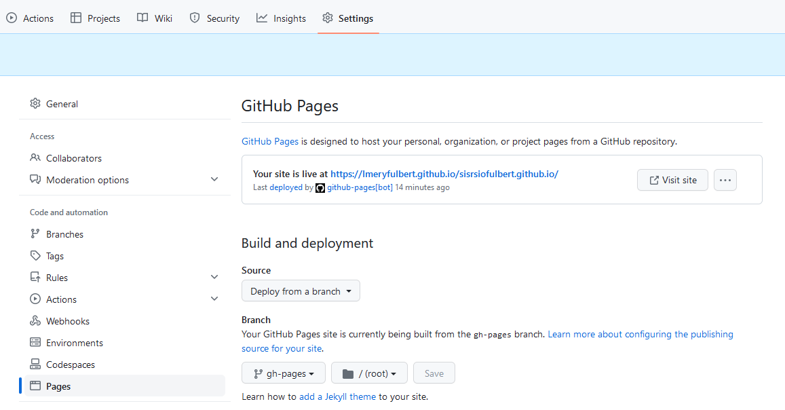

# Situation 2 - Documentation

Cette année le choix technique pour gérer la documentation technique de vos projets est basé sur l'utilisation des github pages et de l'outils mkdocs, outil populaire pour générer de la documentation.

## githubpages

GitHub Pages est un service d'hébergement de sites web statiques proposé par GitHub, qui est une plateforme de développement collaboratif basée sur Git. GitHub Pages permet aux utilisateurs de publier gratuitement des sites web statiques directement depuis leurs dépôts GitHub. Voici quelques points clés à connaître à propos de GitHub Pages :

1. **Sites Web Statiques** : GitHub Pages est conçu pour héberger des sites web statiques. Cela signifie que les sites ne peuvent pas exécuter de code côté serveur, mais ils peuvent afficher du contenu HTML, CSS et JavaScript côté client.

2. **Facilité d'utilisation** : La mise en place d'un site web sur GitHub Pages est relativement simple. Il suffit de créer un dépôt GitHub contenant les fichiers de votre site web, de choisir une branche (généralement "gh-pages") pour publier votre site, et GitHub Pages se charge du reste.

3. **Domaines personnalisés** : Vous pouvez associer un domaine personnalisé à votre site GitHub Pages. Cela signifie que vous pouvez utiliser votre propre nom de domaine (par exemple, www.mon-site.com) au lieu de l'URL par défaut fournie par GitHub.

4. **Intégration avec Git** : Comme GitHub Pages est intégré à Git, vous pouvez facilement mettre à jour votre site en poussant des modifications vers votre dépôt GitHub. Cela facilite le suivi des modifications, la collaboration et la gestion de versions de votre site web.

5. **Prise en charge de Jekyll** : GitHub Pages prend en charge Jekyll, un générateur de sites statiques, ce qui facilite la création de sites web statiques à partir de fichiers Markdown ou de modèles prédéfinis.

6. **Gratuit pour les projets publics et privés** : GitHub Pages est gratuit pour les projets open source et privés. Cependant, notez que les projets privés sont limités à trois dépôts GitHub Pages par compte.

7. **Sécurité** : GitHub Pages offre un certain niveau de sécurité car les sites web sont hébergés sur les serveurs de GitHub, bénéficiant ainsi de certaines des mesures de sécurité de la plateforme.

8. **Utilisations courantes** : GitHub Pages est souvent utilisé pour héberger des sites personnels, des blogs, de la documentation technique, des portfolios, des sites web de projets open source, et bien plus encore.

9. **Support de CI/CD** : Vous pouvez configurer des flux de travail de CI/CD (Intégration Continue / Déploiement Continu) pour automatiser le processus de déploiement de votre site GitHub Pages chaque fois que vous apportez des modifications à votre dépôt.

En résumé, GitHub Pages est un service d'hébergement de sites web statiques offert par GitHub, qui simplifie la publication de sites web en utilisant Git pour le suivi des versions et la gestion des fichiers. C'est une option populaire pour les développeurs et les projets open source qui souhaitent partager leur contenu en ligne de manière efficace et gratuite.

## mkdocs

MkDocs est un générateur de site web statique populaire conçu spécialement pour la création de documentation technique et de sites web de projet. Il est écrit en Python et est particulièrement apprécié par les développeurs, les équipes de projet, et les rédacteurs techniques pour sa simplicité, sa flexibilité et sa facilité d'utilisation. Voici quelques points clés à connaître à propos de MkDocs :

1. **Documentation conviviale** : MkDocs simplifie la création de documentation en utilisant des fichiers Markdown pour écrire du contenu. Le Markdown est un langage de balisage léger qui permet de formater du texte de manière simple et lisible, ce qui en fait un excellent choix pour la rédaction technique.

2. **Génération de site statique** : MkDocs génère des sites web statiques à partir de fichiers Markdown. Cela signifie que le contenu est pré-compilé en HTML, CSS et JavaScript, ce qui rend le site web rapide à charger et facile à héberger sur diverses plateformes.

3. **Thèmes personnalisables** : MkDocs propose une variété de thèmes par défaut, mais vous pouvez également personnaliser le style et la mise en page de votre site en créant votre propre thème ou en en choisissant un parmi de nombreux disponibles sur le dépôt de thèmes MkDocs.

4. **Intégration de recherche** : MkDocs inclut des fonctionnalités de recherche qui permettent aux utilisateurs de trouver rapidement les informations dont ils ont besoin dans la documentation.

5. **Configuration simple** : La configuration de MkDocs se fait via un fichier `mkdocs.yml`, où vous pouvez spécifier les paramètres de votre site, tels que le nom du site, la liste des pages, les thèmes, et bien plus encore.

6. **Déploiement facile** : Une fois que vous avez généré votre site à l'aide de MkDocs, vous pouvez facilement le déployer sur diverses plateformes d'hébergement web, telles que GitHub Pages, Netlify, ou des serveurs web traditionnels.

7. **Prise en charge de l'internationalisation** : MkDocs offre des fonctionnalités pour la traduction de votre documentation dans différentes langues, ce qui le rend adapté aux projets internationaux.

8. **Extensions et plugins** : MkDocs prend en charge de nombreuses extensions et plugins qui peuvent être ajoutés pour étendre ses fonctionnalités, comme l'intégration avec des outils de génération de diagrammes ou des extensions de rendu Markdown avancées.

9. **Communauté active** : MkDocs est un projet open source avec une communauté active de développeurs et d'utilisateurs, ce qui signifie qu'il bénéficie de mises à jour fréquentes et de nombreux tutoriels et ressources disponibles en ligne.

En résumé, MkDocs est un générateur de site web statique qui simplifie la création de documentation technique grâce à l'utilisation de Markdown, de thèmes personnalisables, et d'autres fonctionnalités utiles. Il est largement utilisé dans le développement de logiciels open source, la documentation de projets, et d'autres contextes où la création de documentation est essentielle.

## Installation de mkdocs et deploiement manuel sur github-pages

L'installation de MkDocs Material et son intégration avec GitHub Pages est une procédure relativement simple en suivant ces étapes. Assurez-vous d'avoir Python installé sur votre système, car MkDocs est un générateur de site basé sur Python.

**Étape 1 : Installation de MkDocs et MkDocs Material**

1. Ouvrez votre terminal (ou invite de commande) et exécutez la commande suivante pour installer MkDocs :

   ```
   pip install mkdocs
   ```

2. Ensuite, installez le thème MkDocs Material en exécutant la commande suivante :

   ```
   pip install mkdocs-material
   ```

**Étape 2 : Création d'un projet MkDocs**

1. Créez un nouveau répertoire pour votre projet MkDocs, si ce n'est pas déjà fait, et accédez-y via le terminal :

   ```
   mkdir mon-projet-mkdocs
   cd mon-projet-mkdocs
   ```

2. Initialisez un projet MkDocs en exécutant la commande suivante :

   ```
   mkdocs new .
   ```

   Cela créera une structure de répertoires avec un fichier `mkdocs.yml` pour la configuration et un dossier `docs` pour stocker vos fichiers Markdown.

**Étape 3 : Configuration de MkDocs**

1. Ouvrez le fichier `mkdocs.yml` dans un éditeur de texte de votre choix pour configurer votre projet. Vous pouvez personnaliser le titre, la description, les thèmes, etc.

   Exemple de configuration de base :

   ```yaml
   site_name: Mon Site MkDocs
   theme:
     name: material
   ```

**Étape 4 : Écriture de la documentation**

1. Écrivez votre documentation en utilisant des fichiers Markdown dans le répertoire `docs`. Vous pouvez créer des sous-dossiers pour organiser votre documentation si nécessaire.

**Étape 5 : Aperçu en local**

1. Pour voir votre site MkDocs en local, exécutez la commande suivante :

   ```
   mkdocs serve
   ```

   Cela lancera un serveur de développement local, et vous pourrez accéder à votre site à l'adresse `http://127.0.0.1:8000/` dans votre navigateur.

**Étape 6 : Intégration avec GitHub Pages**

1. Créez un dépôt GitHub pour votre projet MkDocs si vous n'en avez pas déjà un.

2. Assurez-vous que votre dépôt GitHub est public.

3. Configurez votre projet pour déployer sur GitHub Pages. Modifiez le fichier `mkdocs.yml` pour spécifier le nom du dépôt dans la section `repo` :

   ```yaml
   repo: votre-nom-utilisateur/votre-repo-github
   ```

4. Générez le site en exécutant la commande suivante :

   ```
   mkdocs gh-deploy
   ```

5. Cela va générer votre site MkDocs et le publier sur la branche `gh-pages` de votre dépôt GitHub.

6. Vous pouvez maintenant accéder à votre documentation en ligne via l'URL `https://votre-nom-utilisateur.github.io/votre-repo-github/`.

Votre documentation MkDocs est désormais hébergée sur GitHub Pages et peut être facilement mise à jour à chaque modification de votre dépôt. Assurez-vous de consulter la documentation officielle de MkDocs et de MkDocs Material pour plus d'informations sur la personnalisation et l'utilisation avancée.

## Deploiement automatisé à chaque modification de la documentation

Pour déployer automatiquement votre site MkDocs sur GitHub Pages en utilisant GitHub Actions, vous pouvez suivre ces étapes :

**Étape 1 : Création d'un fichier d'action**

1. Dans le répertoire racine de votre projet MkDocs, créez un répertoire nommé `.github` s'il n'existe pas déjà.

2. À l'intérieur du répertoire `.github`, créez un répertoire nommé `workflows`.

3. À l'intérieur du répertoire `workflows`, créez un fichier YAML (par exemple, `deploy.yml`) pour définir votre action. Voici un exemple de contenu pour ce fichier :

ou via github, créer un workflow personnalisé:



```yaml
name: ci 

on:
  push:
    branches:
      - master 
      - main
permissions:
  contents: write
jobs:
  deploy:
    runs-on: ubuntu-latest
    steps:
      - uses: actions/checkout@v3
      - uses: actions/setup-python@v4
        with:
          python-version: 3.x
      - run: echo "cache_id=$(date --utc '+%V')" >> $GITHUB_ENV 
      - uses: actions/cache@v3
        with:
          key: mkdocs-material-${{ env.cache_id }}
          path: .cache
          restore-keys: |
            mkdocs-material-
      - run: pip install mkdocs-material 
      - run: mkdocs gh-deploy --force
```

Assurez-vous de personnaliser le fichier YAML selon vos besoins. Ce fichier YAML définit une action qui se déclenche lorsqu'un push est effectué sur la branche principale (main), construit le site MkDocs, et déploie le site sur GitHub Pages.

**Étape 2 : Configuration des secrets**

Pour que l'action puisse déployer sur GitHub Pages, vous devez définir deux secrets dans les paramètres de votre dépôt GitHub :

1. `ACTIONS_DEPLOY_ACCESS_TOKEN` : Un jeton d'accès personnel avec les autorisations nécessaires pour déployer sur le dépôt. Vous pouvez générer un tel jeton dans les paramètres de votre compte GitHub.

2. `PAGES_BRANCH` : La branche sur laquelle vous souhaitez déployer votre site (par exemple, `gh-pages`).

**Étape 3 : Activation de l'action**

Une fois que vous avez ajouté le fichier YAML et configuré les secrets, l'action sera automatiquement déclenchée à chaque push sur la branche spécifiée (dans cet exemple, la branche principale "main").

Après chaque push sur la branche principale, GitHub Actions construira votre site MkDocs et le déploiera automatiquement sur GitHub Pages.

Vous pouvez consulter le workflow en cours d'exécution en accédant à l'onglet "Actions" de votre dépôt GitHub. Assurez-vous de vérifier les résultats pour vous assurer que le déploiement s'est déroulé avec succès.